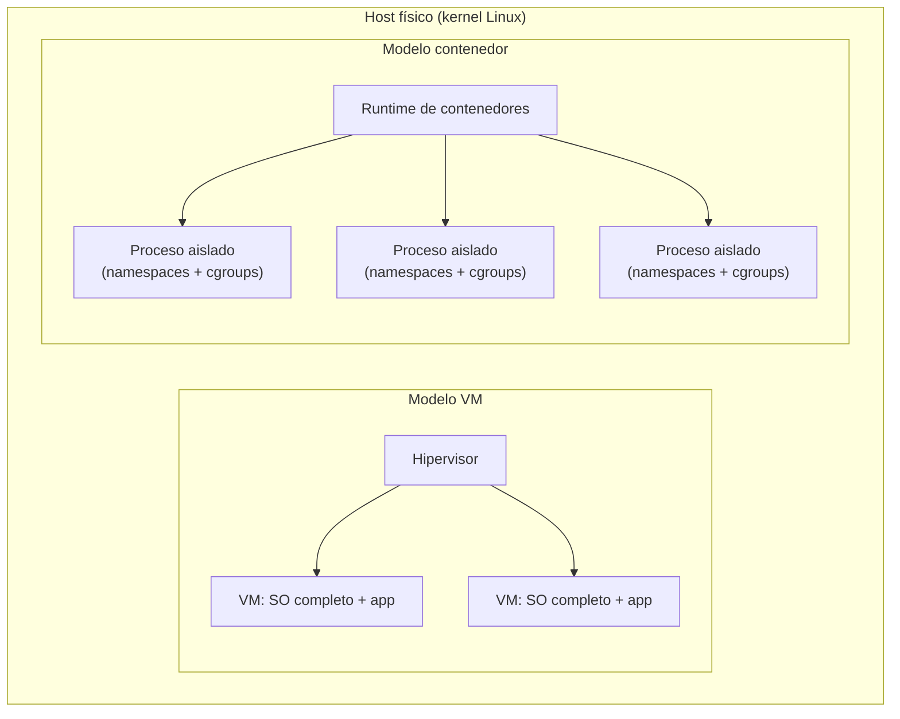

# Contenedores vs VMs y el papel de Docker

[← Índice del bloque](README.md) · [Siguiente: Runtime y CRI →](02-runtime-y-cri.md)

---

## En síntesis

Un contenedor es **un proceso aislado** del resto del sistema mediante mecanismos del kernel de Linux. **No es** una máquina virtual: no tiene su propio kernel ni su propio sistema operativo completo. Docker fue la herramienta que popularizó **empaquetar** ese proceso junto con sus dependencias en una **imagen** portable y **distribuirla** a través de un registro. Kubernetes hereda ese modelo de empaquetado, pero ya **no necesita Docker** para ejecutarlo.

## El problema que da origen al contenedor

Antes incluso de hablar de tecnología, conviene plantear el problema: si se quiere correr la misma aplicación en el portátil de un desarrollador, en preproducción y en producción, y que se comporte exactamente igual en los tres sitios, hace falta resolver de forma reproducible el conjunto de dependencias, librerías y configuración con que arranca el proceso.

Históricamente la respuesta fue **virtualizar una máquina entera**: misma imagen de sistema operativo, mismas librerías, mismo binario. Funciona, pero es caro: cada VM arrastra un sistema operativo completo, su kernel, su gestión de disco y memoria, su tiempo de arranque.

Los contenedores responden lo mismo a un coste mucho menor: se **reutiliza el kernel del host** y se aísla únicamente el espacio de usuario.

## Cómo funciona realmente un contenedor

Un contenedor es un **proceso normal del host** al que el kernel le aplica tres mecanismos clave:

- **Namespaces** — vistas privadas de recursos: PID, red, montajes, usuarios, hostname. Dentro del contenedor, `ps` solo ve sus propios procesos y `ifconfig` ve su propia interfaz.
- **cgroups** — límites de CPU, memoria, IOPS y red. Permiten decir “este proceso no puede pasar de 512 MB”.
- **Sistema de ficheros en capas** — la imagen se monta en *layers* de solo lectura más una capa escribible encima (típicamente OverlayFS).

Esto se traduce en tres consecuencias prácticas:

1. **Arranque en milisegundos**, no en segundos.
2. **Densidad**: un host moderno puede correr cientos de contenedores donde correría decenas de VMs.
3. **No hay aislamiento de kernel**: si el kernel del host se ve afectado, todos los contenedores se ven afectados. Esto importa para entender el modelo de seguridad.

## ¿Y dónde encaja Docker?

Docker no inventó los contenedores: los namespaces y cgroups ya existían en Linux. Lo que aportó fue una **experiencia de desarrollador** que cambió la industria:

| Aporte | Qué resolvió |
|-------|--------------|
| **Imagen** | Un formato de empaquetado reproducible: aplicación + dependencias + configuración por defecto. |
| **Dockerfile** | Una receta declarativa para construir la imagen. |
| **Registry** | Un lugar estándar para publicar y descargar imágenes (Docker Hub y los registros privados que vinieron después). |
| **CLI sencilla** | `docker build`, `docker run`, `docker push`. |

Cuando se habla de “Docker” en realidad se está hablando de **dos cosas** que conviene separar:

1. **El formato de imagen y el flujo de empaquetado/distribución** → esto sigue siendo el estándar, hoy formalizado como **OCI Image**.
2. **El motor de ejecución (Docker Engine)** → esto es lo que se está sustituyendo en plataformas como Kubernetes.

El titular *"Docker se ha quedado obsoleto"* es engañoso. Lo que ha quedado obsoleto es **el motor** dentro de un cluster Kubernetes; las imágenes construidas con `docker build` siguen funcionando perfectamente en cualquier runtime moderno porque siguen el estándar OCI.

## Comparativa

| Característica | Máquina virtual | Contenedor |
|----------------|----------------|-----------|
| Aislamiento | Hardware virtualizado completo | Procesos aislados sobre el mismo kernel |
| Kernel | Uno por VM | Compartido con el host |
| Tamaño típico | GB | MB |
| Arranque | Segundos a minutos | Milisegundos |
| Portabilidad de imagen | Pesada, dependiente de hipervisor | Ligera, estándar OCI |
| Aislamiento de seguridad | Fuerte | Más débil; depende del kernel y de la configuración |

## Una analogía útil

> Una VM es un piso entero con su propia cocina, baño e instalación eléctrica. Un contenedor es una habitación en un coliving: tiene su llave, sus muebles y su privacidad, pero comparte las instalaciones del edificio (el kernel). Por eso una habitación se ocupa en segundos y un piso requiere reformas.

## Diagrama

## Preguntas frecuentes

- **¿Un contenedor es una mini-VM?** No. No hay segundo kernel. La descripción correcta es: proceso aislado mediante namespaces y cgroups.
- **¿Está muerto Docker?** No. Docker sigue vivo como herramienta de desarrollo y construcción de imágenes. Lo que cambia es que Kubernetes ya no lo usa como motor de ejecución en runtime.
- **¿Por qué los contenedores son más rápidos?** Porque arrancan un proceso, no un sistema operativo. La pregunta correcta no es *por qué son rápidos* sino *por qué las VMs son lentas*.
- **¿Y en Windows?** Existen contenedores Windows, pero el modelo dominante en cloud-native (y el que aplica en este recorrido) son los **contenedores Linux**. Docker Desktop en Windows o macOS internamente ejecuta una VM Linux.
- **¿Y la seguridad?** Más débil que en una VM porque el kernel es compartido. En producción seria, los contenedores se combinan con políticas adicionales (seccomp, AppArmor, usuarios no-root, etc.).

## Lo que viene a continuación

Visto qué es un contenedor y cómo se empaqueta con Docker, falta una pregunta clave: cuando Kubernetes ejecuta esos contenedores en sus nodos, ¿quién los pone realmente en marcha? Eso lleva al **runtime de contenedores** y a la interfaz estándar **CRI**.

---

> [!TIP] Laboratorio
>
> **[Lab 1 — Despliegue de aplicaciones →](../lab-01-despliegue/README.md)**
>
> **Descripción.** Primer contacto práctico: ejecutar una aplicación contenedorizada en Kubernetes y exponerla a la red interna.
>
> **Objetivos**
> - Crear un Deployment a partir de una imagen de contenedor.
> - Exponer la aplicación mediante un Service.
> - Observar el estado de los pods y la conectividad interna.
>
> **Encaja con este capítulo** porque comprueba en la práctica que lo que ejecuta Kubernetes son **contenedores** (los conceptos vistos aquí), no máquinas virtuales: pods que arrancan en segundos, comparten kernel y son efímeros.

---

[← Índice del bloque](README.md) · [Siguiente: Runtime y CRI →](02-runtime-y-cri.md)
