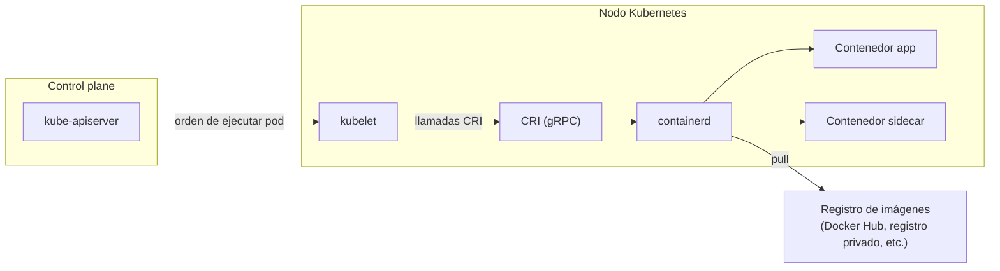

# Tema 2 — Runtime de contenedores en Kubernetes (containerd y CRI)

[← Anterior: Tema 1 — Contenedores vs VMs](01-contenedores-vs-vms.md) · [Índice del bloque ↑](README.md) · [Siguiente: Tema 3 — Orquestación →](03-orquestacion.md)

---

## Para qué este tema

Que el grupo entienda **quién ejecuta realmente los contenedores** dentro de un nodo de Kubernetes y por qué hoy ya **no es Docker**. Es un tema corto pero indispensable: aclara titulares confusos ("¿Kubernetes ya no usa Docker?") y prepara el modelo mental para depurar pods que no arrancan.

## Idea clave en 30 segundos

> En cada nodo de Kubernetes hay un componente llamado **kubelet** que recibe órdenes del control plane. El kubelet no ejecuta contenedores por sí mismo: habla con un **runtime de contenedores** a través de una API estándar llamada **CRI (Container Runtime Interface)**. Hasta 2022 ese runtime solía ser Docker (vía un puente llamado `dockershim`). A partir de la versión **1.24**, Kubernetes **eliminó ese puente**: hoy el runtime estándar es **containerd**. Las imágenes siguen siendo las mismas: el formato OCI es compatible.

## Desarrollo

### 1. Por qué hubo que separar runtime del orquestador

Cuando Kubernetes se diseñó, Docker era el único runtime práctico. Para integrarse, Kubernetes incluía un componente interno (`dockershim`) que traducía sus llamadas al API de Docker. Esto creó un acoplamiento fuerte con un proyecto externo.

Con el tiempo aparecieron otros runtimes (rkt, CRI-O, containerd) y mantener `dockershim` se volvió una carga. La comunidad respondió creando una **interfaz estándar**: cualquier runtime que la implemente puede ser usado por Kubernetes.

Esa interfaz se llama **CRI**. Es un contrato gRPC con operaciones como:

- *"crea un pod sandbox"* (red, namespaces compartidos)
- *"arranca este contenedor dentro del sandbox"*
- *"dame el estado de este contenedor"*
- *"recoge sus logs"*

### 2. Quién es containerd

`containerd` es un runtime de contenedores **ligero**, originalmente extraído del propio Docker (es decir, **es el motor que Docker llevaba dentro**) y donado a la CNCF. Está diseñado para:

- Implementar **CRI** de forma nativa.
- Ejecutar contenedores OCI.
- Gestionar el ciclo de vida (imágenes, almacenamiento, red básica).
- **No** ofrecer la experiencia de desarrollador de Docker (no construye imágenes, no tiene `docker compose`, etc.). Eso es deliberado: containerd hace **una cosa**.

Otras opciones equivalentes (todas hablan CRI):

- **CRI-O**: alternativa promovida por Red Hat, muy ligera y orientada a Kubernetes.
- **Docker Engine via cri-dockerd**: para entornos legacy que aún quieran usar Docker como runtime; existe un puente comunitario.

### 3. Qué cambió en Kubernetes 1.24 (y qué *no* cambió)

Lo que cambió:

- Se eliminó `dockershim` del repositorio de Kubernetes.
- En clústeres nuevos, **el kubelet ya no habla directamente con Docker Engine**.

Lo que **no** cambió:

- **Las imágenes son las mismas.** Una imagen construida con `docker build` es OCI y se ejecuta sin problema en containerd, CRI-O, etc.
- **El flujo de desarrollo** (`docker build` en local, push a un registro privado o Docker Hub) sigue siendo válido.
- **`docker run` en local sigue existiendo**: si quieres probar tu imagen fuera del clúster, sigues usando Docker Engine.

> **Talking point:** *"Lo que se ha quitado es el cable entre Kubernetes y Docker Engine. La fábrica de imágenes (Dockerfile, registries) sigue exactamente igual."*

### 4. Implicaciones operativas

Cuando depures un nodo donde un pod no arranca, conviene saber **qué runtime hay** y **qué herramientas usar** para inspeccionarlo. En entornos containerd:

| Antes (Docker) | Ahora (containerd) |
|----------------|--------------------|
| `docker ps` en el nodo | `crictl ps` (CLI estándar para runtimes CRI) |
| `docker logs <id>` | `crictl logs <id>` (aunque normalmente usaremos `kubectl logs`) |
| `docker images` | `crictl images` |

En el día a día **el operador usa `kubectl`** (`kubectl get pods`, `kubectl describe pod`, `kubectl logs`) y rara vez baja al nodo. `crictl` solo entra en juego en diagnóstico profundo: por ejemplo, un pod en estado `ContainerCreating` indefinido por un problema con la imagen en el nodo.

### 5. Resumiendo la cadena de ejecución en un nodo

1. El **API server** del control plane decide que un pod debe correr en este nodo.
2. El **kubelet** del nodo recibe la especificación del pod.
3. El kubelet llama por **CRI** al runtime instalado (típicamente containerd).
4. **containerd** crea los namespaces y cgroups, descarga la imagen del registro si hace falta, monta la imagen y arranca el proceso.
5. Mientras el contenedor vive, el kubelet le pregunta periódicamente a containerd cómo está y reporta al control plane.

El siguiente diagrama lo muestra a nivel de clúster: el **API server** del Master conversa con cada nodo, y dentro del nodo aparecen explícitamente las interfaces estandarizadas — **CRI** entre kubelet y runtime, **OCI** entre runtime y contenedor, **CNI** para la parte de red — que son las que nos permiten cambiar el runtime sin romper nada.

## Diagrama

## Errores típicos y preguntas frecuentes

- **"¿Tengo que reescribir mis imágenes?"** No. Son OCI, válidas en cualquier runtime CRI.
- **"Entonces, ¿desinstalo Docker de mi portátil?"** No: en local Docker Desktop o Docker Engine sigue siendo útil para construir imágenes y probarlas. La discusión solo aplica a **lo que corre dentro de los nodos del clúster**.
- **"¿Cómo sé qué runtime usa mi clúster?"** `kubectl get nodes -o wide` muestra la columna `CONTAINER-RUNTIME` (p. ej. `containerd://1.7.x`).
- **"¿Y los registros privados con autenticación?"** Se configuran como **secrets de tipo `docker-registry`** y se referencian en el pod con `imagePullSecrets`. Lo veremos en el LAB 4 (configuración y secrets).
- **"¿Hay diferencia de rendimiento?"** Para el 99 % de los casos no es perceptible. Containerd tiene menos overhead que Docker Engine porque no carga la API ni el CLI de Docker en cada nodo, pero esto rara vez es el cuello de botella.

## Puente al siguiente tema

Ya sabemos **qué es un contenedor** y **quién lo ejecuta** dentro de un nodo. La siguiente pregunta es la que justifica todo el curso:

> *"Si correr un contenedor es ya sencillo con Docker, ¿para qué necesito Kubernetes?"*

Eso lo respondemos en el próximo tema: los **problemas de orquestación** que aparecen cuando dejas de tener un solo contenedor en un servidor y pasas a tener cientos repartidos en muchos nodos.

---

[← Anterior: Tema 1 — Contenedores vs VMs](01-contenedores-vs-vms.md) · [Índice del bloque ↑](README.md) · [Siguiente: Tema 3 — Orquestación →](03-orquestacion.md)
