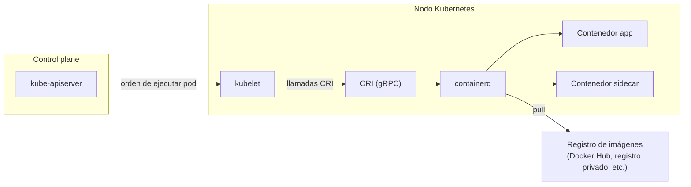

# Runtime de contenedores en Kubernetes (containerd y CRI)

[← Anterior: Contenedores vs VMs](01-contenedores-vs-vms.md) · [Índice del bloque ↑](README.md) · [Siguiente: Orquestación →](03-orquestacion.md)

---

## En síntesis

En cada nodo de Kubernetes hay un componente llamado **kubelet** que recibe órdenes del control plane. El kubelet no ejecuta contenedores por sí mismo: habla con un **runtime de contenedores** a través de una API estándar llamada **CRI (Container Runtime Interface)**. Hasta 2022 ese runtime solía ser Docker (vía un puente llamado `dockershim`). A partir de la versión **1.24**, Kubernetes **eliminó ese puente**: hoy el runtime estándar es **containerd**. Las imágenes siguen siendo las mismas: el formato OCI es compatible.

## Por qué hubo que separar runtime y orquestador

Cuando Kubernetes se diseñó, Docker era el único runtime práctico. Para integrarse, Kubernetes incluía un componente interno (`dockershim`) que traducía sus llamadas al API de Docker. Esto creó un acoplamiento fuerte con un proyecto externo.

Con el tiempo aparecieron otros runtimes (rkt, CRI-O, containerd) y mantener `dockershim` se volvió una carga. La comunidad respondió creando una **interfaz estándar**: cualquier runtime que la implemente puede ser usado por Kubernetes.

Esa interfaz se llama **CRI**. Es un contrato gRPC con operaciones como:

- *“crea un pod sandbox”* (red, namespaces compartidos)
- *“arranca este contenedor dentro del sandbox”*
- *“dame el estado de este contenedor”*
- *“recoge sus logs”*

## Qué es containerd

`containerd` es un runtime de contenedores **ligero**, originalmente extraído del propio Docker (es decir, **es el motor que Docker llevaba dentro**) y donado a la CNCF. Está diseñado para:

- Implementar **CRI** de forma nativa.
- Ejecutar contenedores OCI.
- Gestionar el ciclo de vida (imágenes, almacenamiento, red básica).
- **No** ofrecer la experiencia de desarrollador de Docker (no construye imágenes, no tiene `docker compose`, etc.). Eso es deliberado: containerd hace **una cosa**.

Otras opciones equivalentes (todas hablan CRI):

- **CRI-O**: alternativa promovida por Red Hat, muy ligera y orientada a Kubernetes.
- **Docker Engine vía cri-dockerd**: para entornos legacy que aún quieran usar Docker como runtime; existe un puente comunitario.

## Qué cambió en Kubernetes 1.24 (y qué no)

Lo que cambió:

- Se eliminó `dockershim` del repositorio de Kubernetes.
- En clusters nuevos, **el kubelet ya no habla directamente con Docker Engine**.

Lo que **no** cambió:

- **Las imágenes son las mismas.** Una imagen construida con `docker build` es OCI y se ejecuta sin problema en containerd, CRI-O, etc.
- **El flujo de desarrollo** (`docker build` en local, push a un registro privado o Docker Hub) sigue siendo válido.
- **`docker run` en local sigue existiendo**: para probar una imagen fuera del cluster, Docker Engine sigue valiendo.

Lo que se ha retirado es el cable entre Kubernetes y Docker Engine. La fábrica de imágenes (Dockerfile, registries) sigue exactamente igual.

## Implicaciones operativas

A la hora de depurar un nodo donde un pod no arranca, conviene saber **qué runtime hay** y **qué herramientas usar** para inspeccionarlo. En entornos containerd:

| Antes (Docker) | Ahora (containerd) |
|----------------|--------------------|
| `docker ps` en el nodo | `crictl ps` (CLI estándar para runtimes CRI) |
| `docker logs <id>` | `crictl logs <id>` (aunque normalmente se usa `kubectl logs`) |
| `docker images` | `crictl images` |

En el día a día, la operación se hace con `kubectl` (`kubectl get pods`, `kubectl describe pod`, `kubectl logs`) y rara vez se baja al nodo. `crictl` solo entra en juego en diagnóstico profundo: por ejemplo, un pod en estado `ContainerCreating` indefinido por un problema con la imagen en el nodo.

## Cadena de ejecución en un nodo

1. El **API server** del control plane decide que un pod debe correr en este nodo.
2. El **kubelet** del nodo recibe la especificación del pod.
3. El kubelet llama por **CRI** al runtime instalado (típicamente containerd).
4. **containerd** crea los namespaces y cgroups, descarga la imagen del registro si hace falta, monta la imagen y arranca el proceso.
5. Mientras el contenedor vive, el kubelet le pregunta periódicamente a containerd cómo está y reporta al control plane.

El siguiente diagrama lo muestra a nivel de cluster: el **API server** del Master conversa con cada nodo, y dentro del nodo aparecen explícitamente las interfaces estandarizadas — **CRI** entre kubelet y runtime, **OCI** entre runtime y contenedor, **CNI** para la parte de red — que son las que permiten cambiar el runtime sin romper nada.

## Diagrama

## Preguntas frecuentes

- **¿Hay que reescribir imágenes?** No. Son OCI, válidas en cualquier runtime CRI.
- **¿Hay que desinstalar Docker del portátil?** No: Docker Desktop o Docker Engine en local siguen siendo útiles para construir imágenes y probarlas. La discusión solo aplica a **lo que corre dentro de los nodos del cluster**.
- **¿Cómo se sabe qué runtime usa un cluster?** `kubectl get nodes -o wide` muestra la columna `CONTAINER-RUNTIME` (p. ej. `containerd://1.7.x`).
- **¿Y los registros privados con autenticación?** Se configuran como **secrets de tipo `docker-registry`** y se referencian en el pod con `imagePullSecrets`.
- **¿Hay diferencia de rendimiento?** Para el 99 % de los casos no es perceptible. Containerd tiene menos overhead que Docker Engine porque no carga la API ni el CLI de Docker en cada nodo, pero esto rara vez es el cuello de botella.

## Lo que viene a continuación

Visto qué es un contenedor y quién lo ejecuta dentro de un nodo, la siguiente pregunta es la que justifica todo lo demás: si correr un contenedor es sencillo con Docker, ¿por qué hace falta Kubernetes? Eso lleva a los **problemas de orquestación**.

---

> [!TIP] Laboratorio
>
> **[Lab 1 — Despliegue de aplicaciones →](../lab-01-despliegue/README.md)**
>
> **Descripción.** Primer contacto práctico: ejecutar una aplicación contenedorizada en Kubernetes y exponerla a la red interna.
>
> **Objetivos**
> - Crear un Deployment a partir de una imagen de contenedor.
> - Exponer la aplicación mediante un Service.
> - Observar el estado de los pods y la conectividad interna.
>
> **Encaja con este capítulo** porque, una vez visto **quién** ejecuta los contenedores en el nodo (kubelet → CRI → containerd), el lab muestra ese flujo en acción al programar un pod en un cluster real.

---

[← Anterior: Contenedores vs VMs](01-contenedores-vs-vms.md) · [Índice del bloque ↑](README.md) · [Siguiente: Orquestación →](03-orquestacion.md)
