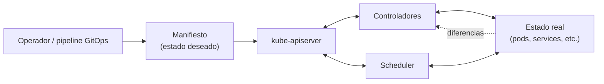

# Orquestación: qué problemas resuelve Kubernetes

[← Anterior: Runtime y CRI](02-runtime-y-cri.md) · [Índice del bloque ↑](README.md) · [Siguiente: Arquitectura →](04-arquitectura-k8s.md)

---

## En síntesis

Tener **un** contenedor corriendo es fácil. El problema empieza cuando hacen falta **muchos**, en **muchos servidores**, **siempre vivos**, **comunicados entre sí**, **actualizables sin caída**, **escalables según la carga** y **reparables automáticamente** cuando un nodo o un contenedor falla. Kubernetes es un **sistema declarativo** que toma esa lista de exigencias como entrada (*"tres réplicas de esto, accesibles por este nombre, expuestas en este puerto"*) y se encarga de **mantener el estado real igual al estado deseado**.

## Del único contenedor al servicio real

Conviene partir del experimento mental de un único `docker run` en un servidor y enumerar lo que pasa al crecer:

| Pregunta | Respuesta con Docker solo |
|---|---|
| El proceso se cae. ¿Quién lo reinicia? | A mano, o con un `--restart=always` muy básico. |
| El servidor entero se cae. ¿Qué pasa? | Caída total hasta que alguien intervenga. |
| Hay que poner una segunda instancia para más carga. ¿Cómo? | A mano: otro servidor, otro `docker run`. |
| Hay que balancear entre las dos. ¿Quién lo hace? | Un balanceador montado y configurado manualmente. |
| Hay que actualizar la versión sin tirar el servicio. ¿Cómo? | Scripts ad-hoc, intervención humana. |
| Tres aplicaciones distintas tienen que descubrirse. ¿Cómo se llaman? | Listas de IPs, ficheros de configuración, frágil. |

Cuando se pasa de un contenedor a un **servicio** real (varias instancias, alta disponibilidad, actualizable), aparece una **lista de problemas operativos** que se repite siempre. Kubernetes resuelve esa lista de forma estandarizada.

## Las preguntas que Kubernetes responde

Es útil enumerarlas explícitamente. Cada una se mapea con un concepto que más adelante aparecerá en el modelo de objetos:

| Problema | Cómo lo resuelve K8s |
|----------|---------------------|
| *"N copias siempre vivas de este contenedor"* | **Deployment / ReplicaSet** |
| *"Si un pod muere, que se levante otro automáticamente"* | Controladores que reconcilian |
| *"Si un nodo muere, que los pods se replanifiquen en otros"* | Scheduler + controladores |
| *"Exponer una app con un nombre estable, aunque los pods cambien"* | **Service** |
| *"Más instancias cuando aumente la carga"* | Escalado manual y HPA |
| *"Actualizar sin caída y poder revertir si falla"* | Rolling update + rollback |
| *"Configuración separada del código de la imagen"* | **ConfigMap** |
| *"Credenciales sin meterlas en el repositorio"* | **Secret** |
| *"Por qué un pod no está sano"* | Logs, eventos, `describe`, probes |
| *"30 microservicios tienen que encontrarse"* | DNS interno + Services |

Cada cosa que aparecerá en los siguientes capítulos responde a una de estas preguntas. Si un manifiesto YAML parece arbitrario, basta volver a esta tabla y preguntar: *¿qué problema operativo está resolviendo?*

## Lo que hace especial a Kubernetes: modelo declarativo y reconciliación

Hay dos formas de operar un sistema:

- **Imperativa** — *"haz esto, ahora esto, ahora esto"*. Es lo que hacen los scripts tradicionales.
- **Declarativa** — *"esto es lo que quiero que sea verdad"*. Es lo que hace Kubernetes.

En Kubernetes se escribe un **estado deseado** ("3 réplicas de la imagen `miapp:1.2.3`, expuestas en el puerto 8080"). Componentes internos llamados **controladores** miran el **estado real** del cluster y, si difiere del deseado, **actúan para igualarlo**. Esto se repite en bucle, indefinidamente.

Consecuencias prácticas:

1. **Auto-reparación.** Si un pod muere, el controlador ve que falta uno y crea otro.
2. **Idempotencia.** Aplicar el mismo manifiesto dos veces no rompe nada: si ya está conforme, no hace nada.
3. **GitOps natural.** Como el estado deseado es texto (YAML), puede versionarse en Git y ser la fuente de verdad.

## Lo que Kubernetes no es

Para evitar expectativas mágicas:

- **No es un PaaS.** No despliega aplicaciones haciendo magia con el código. Hay que darle un contenedor y un manifiesto.
- **No es una solución de almacenamiento.** Coordina volúmenes, pero el almacenamiento subyacente (NFS, EBS, Ceph) lo aportan otros.
- **No reemplaza la arquitectura de la app.** Si la aplicación no tolera reinicios, Kubernetes la reiniciará igualmente y se romperán cosas. Los pods son **efímeros** por diseño.
- **No es gratis.** Operar Kubernetes con seguridad y observabilidad correctas requiere conocimiento y tiempo. No conviene introducirlo *por moda*.

## Cuándo Kubernetes tiene sentido (y cuándo no)

Tiene sentido cuando:

- Hay **muchas aplicaciones** que comparten infraestructura.
- Se necesita **alta disponibilidad** sin scripting frágil.
- Se busca un **modelo común** de despliegue para todos los equipos.
- Interesan **autoescalado** y mejor aprovechamiento de recursos.

Empieza a ser dudoso cuando:

- Hay **una sola aplicación pequeña** y poco crítica.
- El equipo es pequeño y no tiene plataforma dedicada.

Kafka, por su parte, es un sistema distribuido que se beneficia exactamente de lo que Kubernetes resuelve (auto-reparación, escalado, descubrimiento), por lo que el matrimonio entre ambos sistemas tiene mucho sentido.

## Diagrama

> Las flechas que vuelven al control plane representan el **bucle de reconciliación**: el cluster nunca se queda quieto mirando, está continuamente comparando lo deseado con lo real y corrigiéndose.

## Preguntas frecuentes

- **¿Esto no es como Ansible?** Ansible es **imperativo y bajo demanda** (se lanza un playbook). Kubernetes es **declarativo y continuo**: aunque no se lance nada, el cluster sigue corrigiendo desviaciones cada segundo.
- **¿Y si los manifiestos los toca alguien a mano en el cluster?** Sin GitOps, el cluster diverge del repositorio. Con GitOps (Argo CD, Flux) un controlador externo vigila Git y revierte cambios fuera de banda.
- **¿K8s gestiona la base de datos?** Puede orquestar el pod y su volumen, pero la **lógica del dato** (consistencia, backup, replicación) es de la base de datos. Para sistemas stateful complejos (como Kafka), normalmente se usa un **operador** específico.
- **¿Es solo para microservicios?** No, también vale para monolitos. Pero **brilla más** cuanto más distribuido es el sistema.

## Lo que viene a continuación

Justificada la existencia de Kubernetes y vista su función a alto nivel, toca abrir la caja: qué piezas internas se reparten ese trabajo. El siguiente capítulo entra en la **arquitectura** del cluster.

---

[← Anterior: Runtime y CRI](02-runtime-y-cri.md) · [Índice del bloque ↑](README.md) · [Siguiente: Arquitectura →](04-arquitectura-k8s.md)
