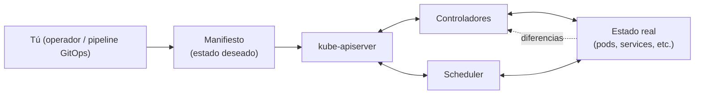

# Tema 3 — Orquestación: qué problemas resuelve Kubernetes

[← Anterior: Tema 2 — Runtime y CRI](02-runtime-y-cri.md) · [Índice del bloque ↑](README.md) · [Siguiente: Tema 4 — Arquitectura →](04-arquitectura-k8s.md)

---

## Para qué este tema

Que quede claro **por qué existe Kubernetes** y qué clase de problemas no podríamos abordar (de forma razonable) con `docker run` repetido varias veces. Este tema es el "vendedor" del resto del curso: si no se entiende aquí, todos los conceptos posteriores (Deployment, Service, replicación) suenan a burocracia.

## Idea clave en 30 segundos

> Tener **un** contenedor corriendo es fácil. El problema empieza cuando necesitas **muchos**, en **muchos servidores**, **siempre vivos**, **comunicados entre sí**, **actualizables sin caída**, **escalables según la carga** y **reparables automáticamente** cuando un nodo o un contenedor falla. Kubernetes es un **sistema declarativo** que toma esa lista de exigencias como entrada (*"quiero 3 réplicas de esto, accesibles por este nombre, expuestas en este puerto"*) y se encarga de **mantener el estado real igual al estado deseado**.

## Desarrollo

### 1. El experimento mental: del único contenedor al servicio real

Pide al grupo que imagine un único `docker run` con su aplicación en un servidor:

| Pregunta | Respuesta con Docker solo |
|---|---|
| El proceso se cae. ¿Quién lo reinicia? | Manualmente, o un `--restart=always` muy básico. |
| El servidor entero se cae. ¿Qué pasa? | Caída total hasta que alguien intervenga. |
| Tengo que poner una segunda instancia para soportar más carga. ¿Cómo? | A mano: otro servidor, otro `docker run`. |
| Quiero balancear entre las dos. ¿Quién lo hace? | Un balanceador montado y configurado a mano. |
| Quiero actualizar la versión sin tirar el servicio. ¿Cómo? | Scripts ad-hoc, intervención humana. |
| Tres aplicaciones distintas tienen que descubrirse entre sí. ¿Cómo se llaman? | Listas de IPs, ficheros de configuración, frágil. |

Conclusión: cuando pasamos de un contenedor a un **servicio** real (varias instancias, alta disponibilidad, actualizable), aparece una **lista de problemas operativos** que se repite siempre. Kubernetes resuelve esa lista de forma estandarizada.

### 2. Las preguntas que Kubernetes responde por nosotros

Es útil enumerarlas explícitamente. Cada una se mapea con un concepto que el curso tratará luego:

| Problema | Cómo lo resuelve K8s | Tema relacionado |
|----------|---------------------|------------------|
| *"Quiero N copias siempre vivas de este contenedor"* | **Deployment / ReplicaSet** | LAB 1 |
| *"Si un pod muere, que se levante otro automáticamente"* | Controladores que reconcilian | Arquitectura (tema 4) |
| *"Si un nodo muere, que los pods se replanifiquen en otros"* | Scheduler + controladores | Tema 4 |
| *"Quiero exponer mi app con un nombre estable, aunque los pods cambien"* | **Service** | LAB 1 |
| *"Quiero más instancias cuando aumente la carga"* | Escalado (manual y HPA) | LAB 2 |
| *"Quiero actualizar sin caída y poder revertir si falla"* | Rolling update + rollback | LAB 2 |
| *"Quiero configuración separada del código de la imagen"* | **ConfigMap** | LAB 4 |
| *"Quiero credenciales sin meterlas en el repositorio"* | **Secret** | LAB 4 |
| *"Quiero ver por qué un pod no está sano"* | Logs, eventos, describe, probes | LAB 3 |
| *"Mis 30 microservicios tienen que encontrarse"* | DNS interno + Services | LAB 1 / LAB 13 |

> **Talking point:** *"Cada cosa que veremos en los próximos laboratorios responde a una de estas preguntas. Si os perdéis en un manifiesto YAML, volved a esta tabla y preguntad: ¿qué problema operativo está resolviendo esto?"*

### 3. Lo que hace especial a Kubernetes: modelo declarativo y reconciliación

Hay dos formas de operar un sistema:

- **Imperativa** — *"haz esto, ahora esto, ahora esto"*. Es lo que hacen los scripts tradicionales.
- **Declarativa** — *"esto es lo que quiero que sea verdad"*. Es lo que hace Kubernetes.

En Kubernetes tú escribes un **estado deseado** ("quiero 3 réplicas de la imagen `miapp:1.2.3`, expuestas en el puerto 8080"). Componentes internos llamados **controladores** miran el **estado real** del clúster y, si difiere del deseado, **actúan para igualarlo**. Esto se repite en bucle, indefinidamente.

Consecuencias prácticas:

1. **Auto-reparación.** Si un pod muere, el controlador ve que falta uno y crea otro. Nadie tiene que despertarse de madrugada.
2. **Idempotencia.** Aplicar el mismo manifiesto dos veces no rompe nada: si ya está conforme, no hace nada.
3. **GitOps natural.** Como el estado deseado es texto (YAML), puede versionarse en Git y ser la fuente de verdad.

### 4. Lo que Kubernetes **no es**

Para evitar expectativas mágicas:

- **No es un PaaS.** No te despliega aplicaciones haciendo magia con tu código. Tú le das un contenedor y un manifiesto.
- **No es una solución de almacenamiento.** Coordina volúmenes, pero el almacenamiento subyacente (NFS, EBS, Ceph) lo aportan otros.
- **No reemplaza la arquitectura de la app.** Si tu aplicación no tolera reinicios, Kubernetes la reiniciará igualmente y romperás cosas. Los pods son **efímeros** por diseño.
- **No es gratis.** Operar Kubernetes con seguridad y observabilidad correctas requiere conocimiento y tiempo. No conviene introducirlo "por moda".

### 5. Cuándo Kubernetes tiene sentido (y cuándo no)

Tiene sentido cuando:

- Tienes **muchas aplicaciones** que comparten infraestructura.
- Necesitas **alta disponibilidad** sin scripting frágil.
- Quieres un **modelo común** de despliegue para todos los equipos.
- Quieres **autoescalado** y aprovechar mejor los recursos.

Empieza a ser dudoso cuando:

- Tienes **una sola aplicación pequeña** y poco crítica.
- El equipo es pequeño y no tiene plataforma dedicada.

En este curso lo aplicamos como **plataforma para correr Kafka** y eso encaja muy bien: Kafka es un sistema distribuido que se beneficia exactamente de lo que Kubernetes resuelve (auto-reparación, escalado, descubrimiento).

## Diagrama

> Las flechas que vuelven al control plane representan el **bucle de reconciliación**: el clúster nunca se queda "quieto" mirando, está continuamente comparando lo deseado con lo real y corrigiéndose.

## Errores típicos y preguntas frecuentes

- **"¿Esto no es como Ansible?"** Ansible es **imperativo y bajo demanda** (lanzas un playbook). Kubernetes es **declarativo y continuo**: aunque no lances nada, el clúster sigue corrigiendo desviaciones cada segundo.
- **"¿Y si los manifiestos los toca alguien a mano en el clúster?"** Sin GitOps, el clúster diverge del repositorio. Con GitOps (Argo CD, Flux) un controlador externo vigila Git y revierte cambios fuera de banda.
- **"¿K8s gestiona la base de datos?"** Puede orquestar el pod y su volumen, pero la **lógica del dato** (consistencia, backup, replicación) es de la base de datos. Para sistemas stateful complejos (como Kafka), normalmente se usa un **operador** específico (lo veremos en bloque 2).
- **"¿Esto es solo para microservicios?"** No, también vale para monolitos. Pero **brilla más** cuanto más distribuido es el sistema.

## Puente al siguiente tema

Hemos justificado por qué existe Kubernetes y qué hace a alto nivel. Ahora toca abrir la caja: **qué piezas internas** se reparten ese trabajo. Pasamos a la **arquitectura** del clúster.

---

[← Anterior: Tema 2 — Runtime y CRI](02-runtime-y-cri.md) · [Índice del bloque ↑](README.md) · [Siguiente: Tema 4 — Arquitectura →](04-arquitectura-k8s.md)
