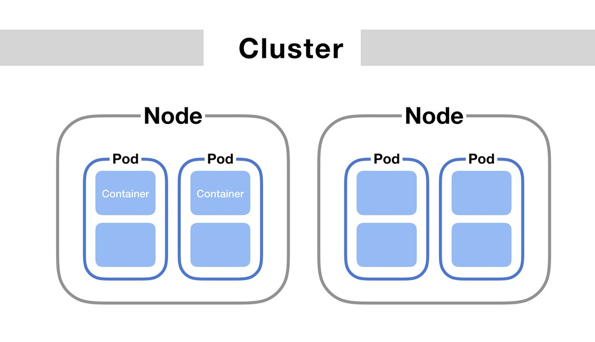
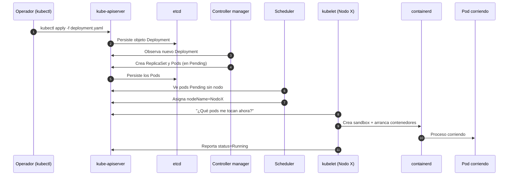
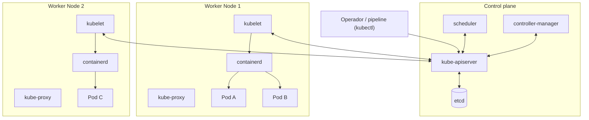

# Arquitectura de Kubernetes: control plane, nodos y ciclo de vida del pod

[← Anterior: Orquestación](03-orquestacion.md) · [Índice del bloque ↑](README.md) · [Siguiente: Objetos y pods →](05-objetos-y-pods.md)

---

## En síntesis

Un cluster tiene **dos tipos de máquinas**: las del **control plane** (el cerebro: API, base de datos del estado, planificación, controladores) y los **nodos worker** (las máquinas que realmente ejecutan los contenedores). El estado deseado vive en una base de datos llamada **etcd**, el **API server** es el único que la toca, y a su alrededor hay piezas que reaccionan a cambios. En el nodo, un **kubelet** habla con el runtime de contenedores y un **kube-proxy** se ocupa de que el tráfico llegue a los pods correctos.

## Las dos capas

Visualmente conviene partir el dibujo en dos:

- **Control plane** — *el cerebro*. Toma decisiones, guarda el estado, expone la API.
- **Plano de datos (nodos)** — *los músculos*. Ejecutan los contenedores reales.

En producción, el control plane suele estar replicado en **3 nodos** dedicados (alta disponibilidad), separado de los workers. En clusters pequeños puede convivir.

Antes de entrar en detalle de cada pieza, conviene fijar la **jerarquía visual** del cluster: dentro del *cluster* hay *nodos*, dentro de cada nodo hay *pods*, y dentro de cada pod hay *contenedores*. Cada concepto siguiente cae siempre en uno de estos niveles.

> Este esquema, muy extendido, todavía dibuja **"Docker"** como motor de contenedores dentro del Worker. Como se vio en el [capítulo anterior](02-runtime-y-cri.md), en Kubernetes moderno ese hueco lo ocupa **containerd** (u otro runtime CRI). Las piezas que rodean (kubelet, kube-proxy, CNI) son idénticas.

## Piezas del control plane

| Componente | Qué hace | Si se cae... |
|------------|----------|--------------|
| **kube-apiserver** | Único punto de entrada al cluster. Recibe peticiones (humanos, controladores, kubelets) y las valida. Es el único que escribe en etcd. | El cluster sigue ejecutando lo que ya estaba, pero no admite cambios. |
| **etcd** | Base de datos clave-valor donde se guarda **todo** el estado deseado y observado. Es la **fuente única de verdad**. | El cluster pierde su memoria. Los backups de etcd son críticos. |
| **kube-scheduler** | Decide **en qué nodo** debe correr cada pod nuevo. Mira recursos disponibles, restricciones, afinidades. | Los pods nuevos quedan en `Pending` hasta que vuelva. |
| **kube-controller-manager** | Conjunto de controladores que ejecutan el bucle de reconciliación (ReplicaSet, Node, Endpoint, ServiceAccount, etc.). | El cluster deja de auto-repararse y de reconciliar. |
| **cloud-controller-manager** (opcional, solo en cloud) | Integra el cluster con el cloud provider (LoadBalancers, volúmenes, rutas). | Las integraciones nativas con cloud dejan de funcionar. |

El API server es el centro de gravedad: cualquier cosa que pase en Kubernetes pasa porque alguien le ha hablado al API server.

## Piezas del nodo worker

| Componente | Qué hace |
|------------|----------|
| **kubelet** | Agente local del nodo. Pregunta al API server *“¿qué pods me toca correr?”* y se los pide al runtime vía CRI. Informa del estado de cada pod. Ejecuta las *liveness/readiness probes*. |
| **Runtime de contenedores** (containerd) | Crea y mantiene los contenedores. |
| **kube-proxy** | Configura las reglas de red del nodo (iptables o IPVS) para que el tráfico hacia un **Service** llegue a alguno de los pods que lo respaldan. |
| **CNI plugin** (Calico, Cilium, Flannel, etc.) | Asigna red al pod cuando arranca y mantiene la conectividad entre pods de distintos nodos. |

## Qué pasa cuando se aplica un manifiesto

Cuatro ideas para subrayar después del diagrama:

1. **Nadie llama directamente al kubelet.** El kubelet es quien pregunta al API server. Es un patrón *pull*: resistente a particiones de red.
2. **Pasar por etcd es lo que da consistencia.** Si el cluster reinicia, el estado vuelve porque vive en etcd, no en RAM.
3. **Los controladores y el scheduler son clientes del API**, exactamente igual que `kubectl`. La API es el bus central.
4. **El pod no salta entre nodos.** Si un nodo cae, el controlador crea un pod **nuevo** en otro nodo. Mismo manifiesto, pod distinto (IP nueva, identidad nueva).

## Ciclo de vida del pod

Un pod recorre estados claros que aparecen en cualquier diagnóstico:

| Estado | Significado |
|--------|-------------|
| **Pending** | El pod existe en etcd pero todavía no corre. Causas habituales: scheduler no encuentra nodo, imagen tardando en descargarse, falta de recursos, volumen no disponible. |
| **Running** | Al menos un contenedor del pod ha arrancado. |
| **Succeeded** | Todos los contenedores terminaron sin error y no se reiniciarán (típico de pods de tipo *job/batch*). |
| **Failed** | Todos los contenedores terminaron, alguno con código distinto de cero, y no se reiniciarán. |
| **Unknown** | El nodo no responde y el API server no sabe en qué estado está. |

Además, dentro del estado del contenedor (`kubectl describe pod`) aparecen razones útiles:

- `ContainerCreating` — el kubelet está creando el contenedor (descarga, montaje de volúmenes).
- `CrashLoopBackOff` — el contenedor arranca y muere repetidamente; Kubernetes espera tiempos crecientes entre reintentos.
- `ImagePullBackOff` — la imagen no se puede descargar (credenciales, nombre erróneo, registro caído).
- `OOMKilled` — el contenedor superó su límite de memoria y el kernel lo mató.
- `Completed` — el proceso terminó con éxito.

## Probes: cómo Kubernetes sabe si una app está viva

Los pods no se reinician *porque sí*. Es el **kubelet**, basándose en *probes* declaradas, quien decide.

- **liveness probe** — *¿sigues vivo?*. Si falla repetidamente, el contenedor se reinicia.
- **readiness probe** — *¿puedes recibir tráfico?*. Si falla, el Service deja de enviarle tráfico pero **no** lo reinicia.
- **startup probe** — *¿has terminado de arrancar?*. Útil para apps lentas; mientras esté en marcha, las otras dos se desactivan.

Una app sin probes correctas es la causa más frecuente de incidentes raros en Kubernetes: o no se reinicia cuando debe, o se reinicia cuando no debe, o recibe tráfico antes de estar lista.

## Diagrama de arquitectura

## Preguntas frecuentes

- **¿etcd es como una base de datos cualquiera?** Es clave-valor, distribuida y altamente consistente (usa Raft). No se usa como BBDD de la aplicación: solo guarda el estado del cluster.
- **¿El scheduler puede mover pods en caliente?** No los mueve: los pods no se reubican una vez arrancados (salvo casos avanzados con *descheduler*). Si un nodo cae, los controladores **crean nuevos** pods en otros nodos.
- **¿Qué pasa si el control plane cae entero?** Las aplicaciones que ya estaban corriendo siguen corriendo (el kubelet ejecuta lo que tiene). No se pueden hacer cambios y la auto-reparación queda en pausa.
- **¿Cuántos masters hacen falta?** Producción: **3 o 5** (impar, para tener quórum en etcd). Lab o desarrollo: 1 basta.
- **¿Por qué un pod queda en Pending para siempre?** Casi siempre: falta de CPU/memoria en nodos, taints/tolerations mal configurados, o `PersistentVolumeClaim` que no encuentra `PersistentVolume`. `kubectl describe pod` lo dice en `Events`.

## Lo que viene a continuación

Vista la arquitectura y dónde vive el estado, toca bajar al objeto más básico que se escribe en YAML: **el pod**, junto con el resto del modelo de objetos declarativos.

---

> [!TIP]
> ### Laboratorio
>
> **[Lab 3 — Diagnóstico de incidencias →](../lab-03-diagnostico/README.md)**
>
> **Descripción.** Aprender a leer un cluster cuando algo no funciona: estados de un pod, eventos del scheduler y mensajes del kubelet.
>
> **Objetivos**
> - Analizar un pod en error a partir de un escenario preparado.
> - Usar logs y eventos del cluster para identificar la causa.
> - Distinguir estados clásicos (`Pending`, `CrashLoopBackOff`, `ImagePullBackOff`, …).
>
> **Encaja con este capítulo** porque pone en juego las piezas del control plane y del nodo (API server, scheduler, kubelet, probes) que se acaban de presentar: cada incidencia se rastrea siguiendo el camino que recorre un pod.

---

[← Anterior: Orquestación](03-orquestacion.md) · [Índice del bloque ↑](README.md) · [Siguiente: Objetos y pods →](05-objetos-y-pods.md)
