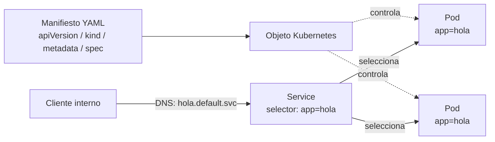

# Modelo de objetos y pods (declarativo)

[← Anterior: Arquitectura](04-arquitectura-k8s.md) · [Índice del bloque ↑](README.md) · [Siguiente: Bloque 2 — Kafka y Confluent →](../../bloque-2-kafka-confluent/fundamentos/README.md)

---

## En síntesis

En Kubernetes todo es un **objeto** con la misma estructura: `apiVersion`, `kind`, `metadata` y `spec`. Se escribe lo que se **quiere** (spec) y el cluster informa de lo que **hay** (status). El objeto más pequeño que se puede pedir es el **pod**: uno o varios contenedores que comparten red y volúmenes, viven y mueren juntos. En la práctica no se crean pods sueltos: se crean **objetos de nivel superior** (Deployment, StatefulSet, Job…) que **crean pods por nosotros**.

## La estructura común a todos los objetos

Cualquier manifiesto en Kubernetes encaja en este esqueleto:

```yaml
apiVersion: <grupo/version>
kind: <tipo de objeto>
metadata:
  name: <nombre único en el namespace>
  namespace: <opcional>
  labels: {...}
  annotations: {...}
spec:
  # lo que se declara como deseado
status:
  # lo que el cluster reporta como real (lo escribe Kubernetes)
```

Cuatro ideas que conviene anclar aquí:

- **`spec` lo escribe quien opera; `status` lo escribe el cluster.** En un `kubectl get pod -o yaml` aparecen ambos: spec lo solicitado, status lo que pasa.
- **`metadata.labels`** son etiquetas clave-valor sobre el objeto. **No son cosméticas:** son **el mecanismo** con el que un Service "encuentra" sus pods, un Deployment selecciona sus réplicas, etc.
- **`metadata.namespace`** es la partición lógica del cluster.
- **`apiVersion` + `kind`** identifican la *clase* del objeto. Si alguno no encaja, el API server rechaza el YAML.

## ¿Qué es un pod, exactamente?

Un **pod** es:

- **La unidad mínima desplegable.** No se le puede pedir a Kubernetes "ejecuta un contenedor"; se le pide "ejecuta un pod" que dentro contiene uno (o varios) contenedores.
- **Una entidad efímera.** No tiene IP estable a largo plazo, ni nombre estable: si muere, el controlador crea otro distinto.
- **Un grupo de contenedores que comparten:** la misma IP, el mismo espacio de red (los contenedores se ven entre sí en `localhost`), volúmenes, y ciclo de vida (mueren juntos).

> Un pod es como un mini-host virtual: una IP, unos volúmenes y dentro procesos que se conocen entre sí por `localhost`. Si dos procesos se hablan muy estrechamente, conviven en el mismo pod. Si no, en pods separados.


## Patrón de un pod con un solo contenedor (el caso normal)

Lo más habitual: **un contenedor por pod**.

```yaml
apiVersion: v1
kind: Pod
metadata:
  name: hola
  labels:
    app: hola
spec:
  containers:
    - name: web
      image: nginx:1.27
      ports:
        - containerPort: 80
```

Importante: **este YAML es un ejemplo didáctico**. En producción no se crean pods sueltos, se crean **Deployments** que crean pods por nosotros (porque sin Deployment, si el pod muere, no vuelve nadie a crearlo).

## Patrón de varios contenedores en un pod (sidecar)

Cuando dos procesos están tan acoplados que tiene sentido que **vivan y mueran juntos** y se hablen por `localhost`, se ponen en el mismo pod. Ejemplos clásicos:

- Un proceso que **recolecta logs** de la aplicación principal (sidecar de logging).
- Un proxy de servicio (sidecar de service mesh, p. ej. Envoy).
- Un init container que prepara configuración antes de que arranque la app.

No es el caso por defecto: si dos componentes pueden escalar de forma independiente, **van en pods separados**.

## Más allá del pod: objetos de carga de trabajo

Casi nunca se trata directamente con pods. Los crean otros objetos:

| Objeto | Para qué se usa |
|--------|----------------|
| **Deployment** | Aplicaciones *stateless* que requieren N réplicas indistinguibles, con rolling update. **El caso por defecto.** |
| **StatefulSet** | Cargas con identidad persistente: cada réplica tiene un nombre estable y su propio volumen. Es lo que usan **Kafka** y otros sistemas distribuidos. |
| **DaemonSet** | Un pod **en cada nodo** del cluster (típico de agentes de logs, métricas, CNI). |
| **Job** | Ejecuta un pod hasta completar una tarea finita. |
| **CronJob** | Lanza Jobs según un calendario. |

Cuando se aborde Kafka, el operador CFK creará **StatefulSets** para los brokers (no Deployments) precisamente porque cada broker tiene identidad y datos propios.


> Un rolling update no sustituye los pods de golpe; crea un **nuevo ReplicaSet** con la versión nueva y va apagando réplicas del antiguo a medida que las nuevas pasan a `Ready`. Por eso el rollback es trivial: el ReplicaSet anterior sigue ahí.

## Services y descubrimiento

Los pods son efímeros: cambian de IP cuando se reinician. Para hablar con ellos hace falta un **nombre estable**. Eso lo da el **Service**:

- Crea un nombre DNS dentro del cluster (`mi-app.mi-namespace.svc.cluster.local`).
- Mantiene una lista de **endpoints** (los pods cuyas labels coinciden con el selector).
- Reparte tráfico (balanceo simple) entre esos endpoints.

Es el ejemplo más claro de **acoplamiento por labels**: el Service no apunta a pods por nombre, los descubre por etiqueta. Eso es lo que permite que las réplicas cambien sin que el cliente note nada.


## Namespaces, brevemente

Un **namespace** es una partición lógica del cluster: agrupa objetos por entorno, equipo o aplicación.

- Los nombres deben ser únicos **dentro** del namespace, no entre namespaces (puede existir `mi-app` en `dev` y otro `mi-app` en `pro`).
- El DNS lleva el namespace incluido: `mi-app.dev.svc.cluster.local`.
- Conviene usar un namespace propio para cada proyecto y no contaminar `default`.

## Imperativo vs declarativo (en el día a día)

`kubectl` permite trabajar de dos formas:

- **Declarativa (recomendada):** se escriben manifiestos YAML versionados y se aplican con `kubectl apply -f`.
- **Imperativa (puntual):** comandos como `kubectl run`, `kubectl create deployment`, `kubectl scale`, útiles para experimentar rápido o trabajar en una crisis.

Lo idóneo en producción es **declarativo + GitOps**.

## Diagrama: objeto, pod y service



## Preguntas frecuentes

- **¿Por qué no se crea un Pod a pelo?** Si se crea suelto y muere, no vuelve nadie a crearlo: el Pod no tiene controlador asociado. **Deployment sí** (vía ReplicaSet).
- **¿Las labels son obligatorias?** Técnicamente no, pero sin labels los Services y los selectores quedan vacíos. *Si no se etiqueta, no se descubre.*
- **¿Cuándo conviene un pod multi-contenedor?** Solo cuando los contenedores **deben** compartir red, volumen y ciclo de vida. En caso de duda, **separar en pods distintos**.
- **¿Por qué `apiVersion` cambia?** Distintos recursos viven en distintos grupos de API y versiones. Pods están en `v1` (core). Deployments en `apps/v1`. Es metadata del propio API server, no de la aplicación.
- **¿Y los recursos?** Cada contenedor puede declarar `requests` (lo que necesita garantizado) y `limits` (lo máximo permitido). Sin requests, el scheduler asume 0 y puede sobrecargar el nodo.

## Lo que viene a continuación

Con esto se cierra la base de Kubernetes. El siguiente bloque entra en **Kafka y Confluent**: un caso paradigmático de sistema distribuido stateful que se beneficia de todo lo visto hasta aquí, y donde los conceptos de identidad, volumen y descubrimiento toman especial relevancia.

---

> [!TIP]
> ### Laboratorio
>
> **[Lab 4 — ConfigMaps y Secrets →](../lab-04-configuracion/README.md)**
>
> **Descripción.** Externalizar la configuración de una aplicación (parámetros y credenciales) fuera de la imagen, usando los objetos declarativos vistos en este capítulo.
>
> **Objetivos**
> - Crear y montar un ConfigMap como variables o ficheros en el pod.
> - Crear y consumir un Secret sin exponer su contenido en el manifiesto.
> - Verificar que el cambio de configuración no obliga a reconstruir la imagen.
>
> **Encaja con este capítulo** porque ConfigMap y Secret son **objetos** del mismo modelo declarativo (`apiVersion`, `kind`, `metadata`, `spec`) y se asocian a un Pod por referencia, completando el catálogo básico de recursos del bloque.

---

[← Anterior: Arquitectura](04-arquitectura-k8s.md) · [Índice del bloque ↑](README.md) · [Siguiente: Bloque 2 — Kafka y Confluent →](../../bloque-2-kafka-confluent/fundamentos/README.md)
