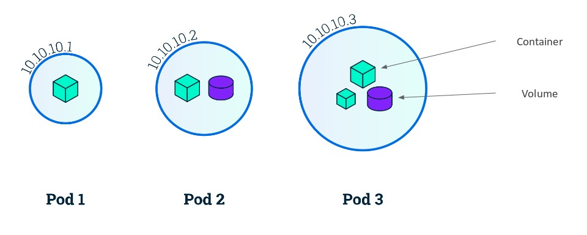
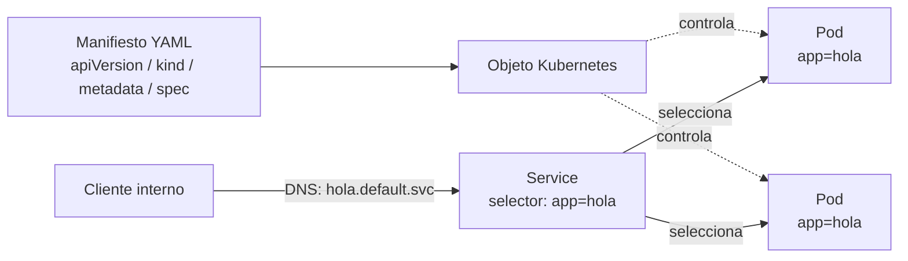

# Tema 5 — Modelo de objetos y pods (declarativo)

[← Anterior: Tema 4 — Arquitectura](04-arquitectura-k8s.md) · [Índice del bloque ↑](README.md) · [Siguiente: Bloque 2 — Kafka y Confluent →](../../bloque-2-kafka-confluent/fundamentos/README.md)

---

## Para qué este tema

Cerrar el bloque introductorio explicando **cómo describimos lo que queremos** en Kubernetes: la unidad mínima desplegable (el **pod**) y la estructura común de **cualquier** objeto del clúster. Con esto, los participantes podrán leer cualquier YAML del curso sin sensación de estar mirando un idioma extranjero.

## Idea clave en 30 segundos

> En Kubernetes todo es un **objeto** con la misma estructura: `apiVersion`, `kind`, `metadata` y `spec`. Escribes lo que **quieres** (spec) y el clúster te dice lo que **hay** (status). El objeto más pequeño que puedes pedir es el **pod**: uno o varios contenedores que comparten red y volúmenes, viven y mueren juntos. En la práctica no creamos pods sueltos: creamos **objetos de nivel superior** (Deployment, StatefulSet, Job…) que **crean pods por nosotros**.

## Desarrollo

### 1. La estructura común a todos los objetos

Cualquier manifiesto en Kubernetes encaja en este esqueleto:

```yaml
apiVersion: <grupo/version>
kind: <tipo de objeto>
metadata:
  name: <nombre único en el namespace>
  namespace: <opcional>
  labels: {...}
  annotations: {...}
spec:
  # lo que el usuario declara como deseado
status:
  # lo que el clúster reporta como real (lo escribe Kubernetes, no tú)
```

Cuatro ideas que conviene anclar aquí:

- **`spec` lo escribes tú, `status` lo escribe el clúster.** En un `kubectl get pod -o yaml` verás ambos: spec lo que pediste, status lo que pasa.
- **`metadata.labels`** son etiquetas clave-valor sobre el objeto. **No son cosméticas:** son **el mecanismo** con el que un Service "encuentra" sus pods, un Deployment selecciona sus réplicas, etc.
- **`metadata.namespace`** es la partición lógica del clúster (luego lo vemos).
- **`apiVersion` + `kind`** identifican la *clase* del objeto. Si te equivocas en alguno, el API server rechaza el YAML.

### 2. ¿Qué es un pod, exactamente?

Un **pod** es:

- **La unidad mínima desplegable.** No puedes pedirle a Kubernetes "ejecuta un contenedor"; le pides "ejecuta un pod" que dentro contiene uno (o varios) contenedores.
- **Una entidad efímera.** No tiene IP estable a largo plazo, ni nombre estable: si muere, el controlador crea otro distinto.
- **Un grupo de contenedores que comparten:** la misma IP, el mismo espacio de red (los contenedores se ven entre sí en `localhost`), volúmenes, y ciclo de vida (mueren juntos).

> **Talking point:** *"Un pod es como un mini-host virtual: una IP, unos volúmenes y dentro de él procesos que se conocen entre sí en localhost. Si necesitáis que dos procesos se hablen muy estrechamente, conviven en el mismo pod. Si no, en pods separados."*



### 3. Patrón de un pod con un solo contenedor (el caso normal)

Lo más habitual: **un contenedor por pod**.

```yaml
apiVersion: v1
kind: Pod
metadata:
  name: hola
  labels:
    app: hola
spec:
  containers:
    - name: web
      image: nginx:1.27
      ports:
        - containerPort: 80
```

Hay que decir explícitamente: **este YAML lo mostramos como ejemplo didáctico. En producción no se crean pods sueltos**, se crean **Deployments** que crean pods por nosotros (porque sin Deployment, si el pod muere, no vuelve nadie a crearlo). Lo veremos en el LAB 1.

### 4. Patrón de varios contenedores en un pod (sidecar)

Cuando dos procesos están tan acoplados que tiene sentido que **vivan y mueran juntos** y se hablen por `localhost`, se ponen en el mismo pod. Ejemplos clásicos:

- Un proceso que **recolecta logs** de la aplicación principal (sidecar de logging).
- Un proxy de servicio (sidecar de service mesh, p. ej. Envoy).
- Un init container que prepara configuración antes de que arranque la app.

No es el caso por defecto: si dos componentes pueden escalar de forma independiente, **van en pods separados**.

### 5. Más allá del pod: objetos de carga de trabajo

Casi nunca trataremos directamente con pods. Los crearán otros objetos:

| Objeto | Para qué se usa |
|--------|----------------|
| **Deployment** | Aplicaciones *stateless* que requieren N réplicas indistinguibles, con rolling update. **El caso por defecto.** |
| **StatefulSet** | Cargas con identidad persistente: cada réplica tiene un nombre estable y su propio volumen. Es lo que usan **Kafka** y otros sistemas distribuidos. |
| **DaemonSet** | Un pod **en cada nodo** del clúster (típico de agentes de logs, métricas, CNI). |
| **Job** | Ejecuta un pod hasta completar una tarea finita. |
| **CronJob** | Lanza Jobs según un calendario. |

Cuando lleguemos a Kafka, el operador CFK creará **StatefulSets** para los brokers (no Deployments) precisamente porque cada broker tiene identidad y datos propios.


> Este diagrama anticipa lo que harás en el **LAB 2**: un rolling update no sustituye los pods de golpe; crea un **nuevo ReplicaSet** con la versión nueva y va apagando réplicas del antiguo a medida que las nuevas pasan a `Ready`. Por eso el rollback es trivial: el ReplicaSet anterior sigue ahí.

### 6. Services y descubrimiento (anticipo del LAB 1)

Los pods son efímeros: cambian de IP cuando se reinician. Para hablar con ellos hace falta un **nombre estable**. Eso lo da el **Service**:

- Crea un nombre DNS dentro del clúster (`mi-app.mi-namespace.svc.cluster.local`).
- Mantiene una lista de **endpoints** (los pods cuyas labels coinciden con el selector).
- Reparte tráfico (balanceo simple) entre esos endpoints.

Es el ejemplo más claro de **acoplamiento por labels**: el Service no apunta a pods por nombre, los descubre por etiqueta. Eso es lo que permite que las réplicas cambien sin que el cliente note nada.


### 7. Namespaces, brevemente

Un **namespace** es una partición lógica del clúster: agrupa objetos por entorno, equipo o aplicación.

- Los nombres deben ser únicos **dentro** del namespace, no entre namespaces (puedes tener `mi-app` en `dev` y otro `mi-app` en `pro`).
- El DNS lleva el namespace incluido: `mi-app.dev.svc.cluster.local`.
- Conviene usar al menos uno propio para nuestros laboratorios y no contaminar `default`.

### 8. Imperativo vs declarativo (en el día a día)

Para terminar conviene aclarar que `kubectl` permite trabajar de dos formas:

- **Declarativa (recomendada):** escribimos manifiestos YAML versionados, aplicamos con `kubectl apply -f`. Es lo que veremos en los laboratorios.
- **Imperativa (puntual / didáctica):** comandos como `kubectl run`, `kubectl create deployment`, `kubectl scale`, útiles para experimentar rápido o trabajar en una crisis.

Lo idóneo en producción es **declarativo + GitOps**.

## Diagrama: objeto, pod y service



## Errores típicos y preguntas frecuentes

- **"¿Por qué no se crea un Pod a pelo?"** Si lo creas suelto y muere, no vuelve nadie a crearlo: Pod no tiene controlador asociado. **Deployment sí** (vía ReplicaSet).
- **"¿Las labels son obligatorias?"** Técnicamente no, pero sin labels los Services y los selectores quedan vacíos. *Si no etiquetas, no descubres.*
- **"¿Cuándo conviene un pod multi-contenedor?"** Solo cuando los contenedores **deben** compartir red, volumen y ciclo de vida. Si dudas, **separa en pods distintos**.
- **"¿Por qué `apiVersion` cambia?"** Distintos recursos viven en distintos grupos de API y versiones. Pods están en `v1` (core). Deployments en `apps/v1`. Es metadata del propio API server, no de tu app.
- **"¿Y los recursos?"** Cada contenedor puede declarar `requests` (lo que necesita garantizado) y `limits` (lo máximo permitido). Sin requests, el scheduler "asume" 0 y puede sobrecargar el nodo. Lo veremos brevemente en el LAB 2.

## Puente a los laboratorios

Con esto cerramos el bloque teórico. A partir de aquí los participantes ya tienen el vocabulario y la lógica mental para empezar a trabajar:

- **LAB 1** — Aplican un Deployment + Service y observan pods y conectividad interna.
- **LAB 2** — Escalan réplicas y hacen un rolling update con rollback.
- **LAB 3** — Diagnostican pods en error usando logs, eventos y describe (vuelve aquí el ciclo de vida del pod del tema 4).
- **LAB 4** — Separan configuración y secretos del código de la imagen.

Cuando entremos en el bloque 2 (Kafka), recordaremos: **los brokers de Kafka serán StatefulSets, no Deployments, porque tienen identidad y datos**. Aquí ya hemos sembrado esa idea.

---

[← Anterior: Tema 4 — Arquitectura](04-arquitectura-k8s.md) · [Índice del bloque ↑](README.md) · [Siguiente: Bloque 2 — Kafka y Confluent →](../../bloque-2-kafka-confluent/fundamentos/README.md)
