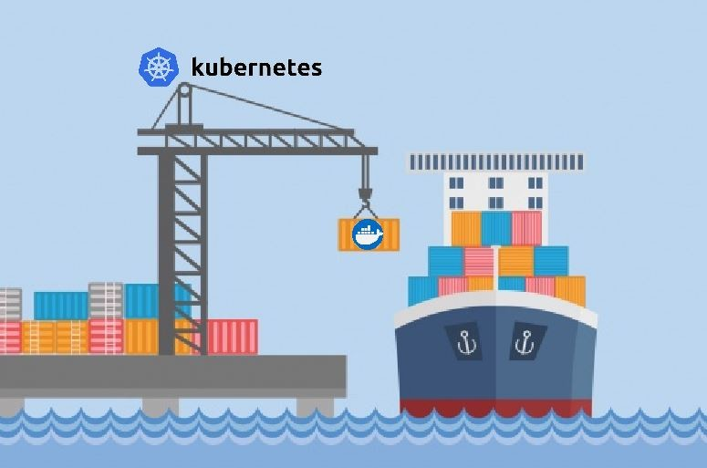

# Bloque 1 — Fundamentos de Kubernetes

[← Inicio](../../README.md) · [Siguiente: Contenedores vs VMs y rol de Docker →](01-contenedores-vs-vms.md)

---

Este bloque cubre los fundamentos necesarios para entender qué es Kubernetes, qué problemas resuelve y cómo está construido por dentro. Parte de la pieza más pequeña —un contenedor— y termina en el modelo declarativo con el que se describe cualquier carga de trabajo del cluster.

## Laboratorios del bloque

Ruta práctica del programa (labs **1–4**), enlazada también al final de cada capítulo:

**[LAB 1 — Despliegue →](../lab-01-despliegue/README.md)** · **[LAB 2 — Escalado y actualizaciones →](../lab-02-escalado-actualizaciones/README.md)** · **[LAB 3 — Diagnóstico →](../lab-03-diagnostico/README.md)** · **[LAB 4 — ConfigMaps y Secrets →](../lab-04-configuracion/README.md)**

## Capítulos

| # | Título | Archivo |
|--:|--------|---------|
| 1 | Contenedores vs VMs y rol de Docker | [`01-contenedores-vs-vms.md`](01-contenedores-vs-vms.md) |
| 2 | Runtime en Kubernetes: containerd y CRI | [`02-runtime-y-cri.md`](02-runtime-y-cri.md) |
| 3 | Orquestación: qué problemas resuelve Kubernetes | [`03-orquestacion.md`](03-orquestacion.md) |
| 4 | Arquitectura: control plane, nodos y ciclo de vida del pod | [`04-arquitectura-k8s.md`](04-arquitectura-k8s.md) |
| 5 | Modelo de objetos y pods (declarativo) | [`05-objetos-y-pods.md`](05-objetos-y-pods.md) |

---

[← Inicio](../../README.md) · [Siguiente: Contenedores vs VMs y rol de Docker →](01-contenedores-vs-vms.md)
