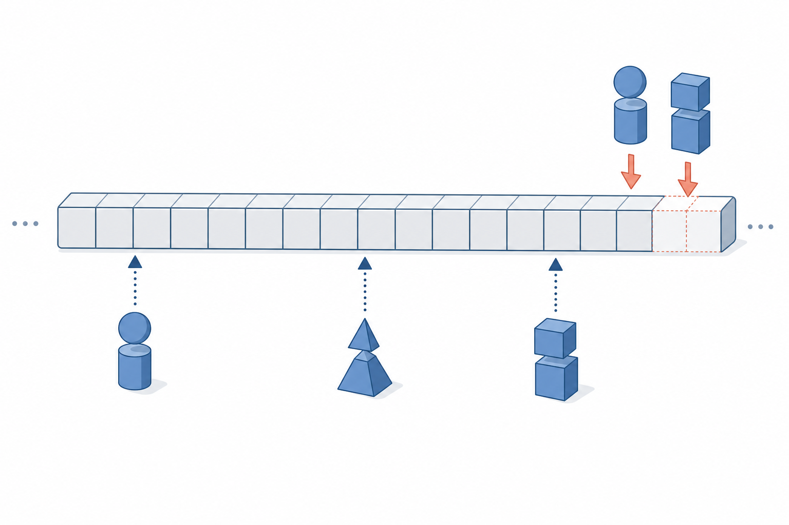
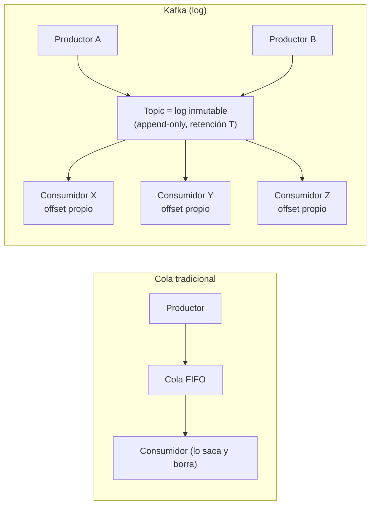

# Event streaming y modelo Kafka

[← Índice del bloque](README.md) · [Siguiente: Brokers, topics y particiones →](02-brokers-topics-particiones.md)

---

## En síntesis

Kafka es un **log inmutable, ordenado, persistido y distribuido**. Los productores **añaden eventos al final**, los consumidores **leen avanzando por el log al ritmo que quieran**, y los datos **permanecen** mientras la política de retención lo diga (no se borran al ser leídos). Esto cambia por completo el patrón habitual de mensajería: un mismo evento puede ser leído por **muchos consumidores diferentes y en momentos diferentes**, incluso releído.

## Punto de partida: el modelo de cola tradicional

Una **cola** (RabbitMQ, ActiveMQ, SQS) responde a esta lógica:

- Un productor pone mensajes.
- Un consumidor los saca y los **elimina** al procesar.
- El propósito es **acoplar** productor y consumidor a través de un buffer transaccional.

Limitaciones que aparecen pronto:

- Una vez consumido, el mensaje **ya no existe**: si otro sistema quiere leerlo, hay que duplicarlo o tirar de mecanismos *fan-out*.
- Reprocesar histórico es complicado (no hay histórico, hay cola).
- Escalar consumidores que necesitan **el mismo orden** es difícil.

Kafka cambia el paradigma: **no piensa en colas, piensa en logs**.

## La idea del log

Un *log* en este contexto **no es** un archivo de trazas. Es la estructura de datos más sencilla del mundo: una **secuencia ordenada e inmutable** de registros donde solo se pueden hacer dos cosas:

- **Append** al final.
- **Leer** desde una posición.

Cada registro tiene una **posición** (offset) que jamás cambia. Si hoy se lee el offset 1.000.000, dentro de un año seguirá siendo el mismo registro.

Consecuencias:

- **Orden garantizado dentro de un log.**
- **Múltiples lectores independientes.** Cada uno avanza con su propio puntero.
- **Reprocesar es trivial.** Solo hay que reiniciar el puntero.
- **El productor no sabe ni le importa cuántos consumidores hay.**



## Kafka aplica el log a la mensajería entre sistemas

Esquema mental:

```
Productores   →   [ topic = log distribuido ]   →   N consumidores independientes
                                                    (cada uno con su offset)
```


Frente al modelo clásico de cola, donde un mensaje se reparte entre consumidores y desaparece tras procesarse, Kafka emplea un modelo **publicador/suscriptor** sobre el log: el mismo mensaje puede ser leído por **varios consumidores distintos en paralelo**, en lo que conceptualmente es un *broadcast* desde el topic.


Diferencias con la cola tradicional, subrayadas:

1. **No se elimina al leer.** Los mensajes viven mientras la retención lo permita (por tiempo, por tamaño, o forever si así se configura).
2. **Cada consumidor lleva su puntero (offset).** Dos sistemas distintos leen el mismo topic sin estorbarse, a velocidades distintas.
3. **El orden se garantiza por particiones** (no por topic completo).
4. **La unidad de paralelismo no es el consumer sino la partition.**

## ¿Para qué se usa Kafka en la práctica?

Cuatro patrones canónicos:

- **Bus de eventos entre microservicios.** Un servicio publica un evento (`order.created`) y N servicios reaccionan (facturación, almacén, métricas) sin acoplarse entre sí.
- **Pipeline de ingestión.** Logs y métricas de aplicaciones se vuelcan a Kafka y de ahí van a distintos destinos (Elastic, S3, BigQuery) sin reinventar la rueda.
- **Captura de cambios de base de datos (CDC).** Cambios en una BBDD se vuelcan como eventos para que otros sistemas se mantengan sincronizados.
- **Event sourcing.** El log es la **fuente de verdad** del estado: el estado se reconstruye reproduciendo eventos.

Alrededor del cluster Kafka acaba apareciendo un ecosistema con cuatro tipos de clientes muy diferenciados que se irán cubriendo a lo largo del bloque: **Producers** (aplicaciones que escriben eventos), **Consumers** (aplicaciones que los procesan), **Stream Processors** (componentes que leen, transforman y reescriben flujos) y **Connectors** (puentes a bases de datos y otros sistemas externos).

![Diagrama radial centrado en un rectángulo "Kafka Cluster": en la parte superior, tres "App" etiquetadas como Producers escriben hacia el cluster; en la parte inferior, tres "App" etiquetadas como Consumers leen del cluster; a la derecha, dos "App" Stream Processors leen y escriben sobre el mismo cluster; a la izquierda, dos cilindros "DB" conectados al cluster a través de Connectors, ilustrando cómo Kafka actúa como hub central rodeado de productores, consumidores, procesadores de stream y conectores a sistemas externos](images/kafka-apis-ecosistema.png)

## Anatomía de un evento Kafka

Un mensaje Kafka (oficialmente *record*) tiene:

- **Clave (key)** — opcional pero importantísima. Determina **a qué partición** va el evento (se hashea). Mensajes con la misma clave acaban en la misma partición → mismo orden.
- **Valor (value)** — el cuerpo del mensaje (JSON, Avro, Protobuf, binario, lo que sea).
- **Headers** — metadatos opcionales (trazas, tenant, versión de esquema).
- **Timestamp** — momento del evento.
- **Offset y partición** — los pone Kafka cuando lo persiste.

La clave es lo más infravalorado de Kafka: define orden y reparto.

## Y Confluent

Apache Kafka es la base. **Confluent** es la empresa fundada por los creadores originales (LinkedIn) que distribuye una **plataforma alrededor** de Kafka. Lo importante:

- **Confluent Platform** = Apache Kafka + extras (Schema Registry, Kafka Connect, ksqlDB, herramientas operativas, Control Center, …).
- **Confluent Cloud** = el mismo conjunto en modelo SaaS.
- **CFK (Confluent for Kubernetes)** = el operador que despliega y mantiene la plataforma sobre Kubernetes.

El motor sigue siendo Kafka; lo que cambia es el embalaje, las herramientas y el soporte.

## Diagrama: log distribuido vs cola



## Preguntas frecuentes

- **¿Entonces Kafka es como Rabbit pero mejor?** No. Es **un modelo distinto**, no una versión mejorada de cola. Hay casos donde una cola tradicional es la elección correcta (mensajes individuales con ACK fino, dead-letter, baja latencia transaccional). Kafka brilla en **streams** y *fan-out* a múltiples consumidores.
- **¿Y si se quiere borrar un mensaje concreto?** No es el patrón. Se puede esperar a que la retención lo expire o usar topics *compactados* con tombstones (caso especial, no de uso general).
- **¿Es seguro tener varios lectores leyendo lo mismo?** Sí, es **el objetivo**. Kafka está diseñado para fan-out masivo.
- **¿Cuánto tiempo se quedan los mensajes?** Depende de la **retención** del topic: por tiempo (`retention.ms`) o por tamaño (`retention.bytes`). Por defecto, 7 días.
- **¿Kafka es base de datos?** No, pero comparte una propiedad: el log es **fuente de verdad** y reproducible. Algunas arquitecturas (event sourcing) lo tratan como tal.

## Lo que viene a continuación

Vista la idea de log distribuido, la pregunta natural es cómo se reparte físicamente entre máquinas. Entran en escena los **brokers**, los **topics** y, sobre todo, las **particiones**, que son la unidad real de paralelismo de Kafka.

---

> [!TIP] Laboratorio
>
> **[Lab 5 — Flujo básico de datos →](../lab-05-flujo-basico/README.md)**
>
> **Descripción.** Primer contacto práctico con Kafka como log distribuido: crear un topic, escribir mensajes y leerlos.
>
> **Objetivos**
> - Crear un topic.
> - Producir mensajes y consumirlos.
> - Observar la persistencia y el orden de los mensajes.
>
> **Encaja con este capítulo** porque pone en práctica el modelo conceptual recién presentado: log append-only, productores que no conocen a los consumidores y lectura por puntero.

---

[← Índice del bloque](README.md) · [Siguiente: Brokers, topics y particiones →](02-brokers-topics-particiones.md)
