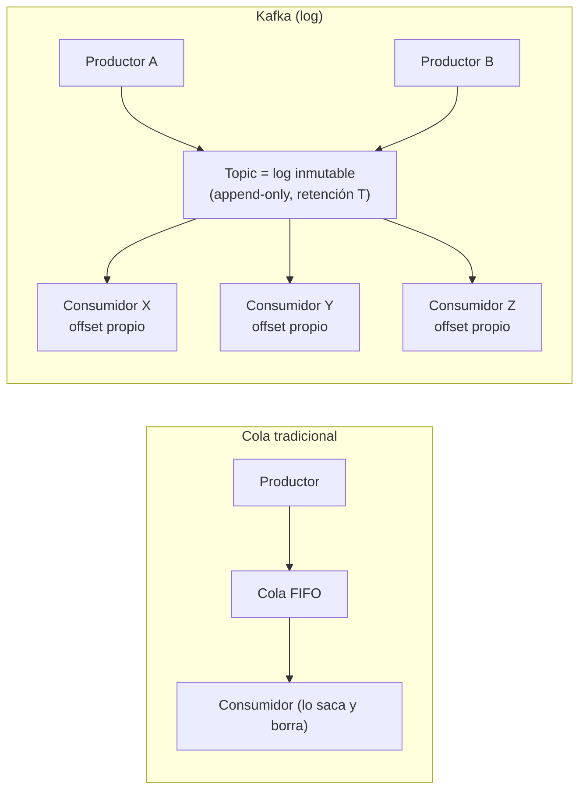

# Tema 1 — Event streaming y modelo Kafka

[← Índice del bloque](README.md) · [Siguiente: Tema 2 — Brokers, topics y particiones →](02-brokers-topics-particiones.md)

---

## Para qué este tema

Asentar la idea fundamental: **Kafka no es una cola, es un log distribuido**. Si esta diferencia queda clara, todo lo demás (consumer groups, offsets, retención, replicación) cae por su propio peso. Si no, el grupo arrastrará confusiones durante todo el bloque.

## Idea clave en 30 segundos

> Kafka es un **log inmutable, ordenado, persistido y distribuido**. Los productores **añaden eventos al final**, los consumidores **leen avanzando por el log al ritmo que quieran**, y los datos **permanecen** mientras la política de retención lo diga (no se borran al ser leídos). Esto cambia por completo el patrón habitual de mensajería: un mismo evento puede ser leído por **muchos consumidores diferentes y en momentos diferentes**, incluso releído.

## Desarrollo

### 1. Punto de partida: el modelo "cola tradicional"

Una **cola** (RabbitMQ, ActiveMQ, SQS) responde a esta lógica:

- Un productor pone mensajes.
- Un consumidor los saca y los **elimina** al procesar.
- El propósito es **acoplar** productor y consumidor a través de un buffer transaccional.

Limitaciones que aparecen pronto:

- Una vez consumido, el mensaje **ya no existe**: si otro sistema quiere leerlo, hay que duplicarlo o tirar de mecanismos *fan-out*.
- Reprocesar histórico es complicado (no hay histórico, hay cola).
- Escalar consumidores que necesitan **el mismo orden** es difícil.

Kafka cambia el paradigma: **no piensa en colas, piensa en logs**.

### 2. La idea del log

Un *log* en este contexto **no es** un archivo de trazas. Es la estructura de datos más sencilla del mundo: una **secuencia ordenada e inmutable** de registros donde solo puedes hacer dos cosas:

- **Append** al final.
- **Leer** desde una posición.

Cada registro tiene una **posición** (offset) que jamás cambia. Si lees el offset 1.000.000, dentro de un año seguirá siendo el mismo registro.

Consecuencias:

- **Orden garantizado dentro de un log.**
- **Múltiples lectores independientes.** Cada uno avanza con su propio puntero.
- **Reprocesar es trivial.** Solo hay que reiniciar el puntero.
- **El productor no sabe ni le importa cuántos consumidores hay.**


### 3. Kafka aplica el log a la mensajería entre sistemas

Esquema mental para el aula:

```
Productores   →   [ topic = log distribuido ]   →   N consumidores independientes
                                                    (cada uno con su offset)
```

Diferencias con la cola tradicional, escritas con énfasis para subrayarlas:

1. **No se elimina al leer.** Los mensajes viven mientras la retención lo permita (por tiempo, por tamaño, o forever si así se configura).
2. **Cada consumidor lleva su puntero (offset).** Dos sistemas distintos leen el mismo topic sin estorbarse, a velocidades distintas.
3. **El orden se garantiza por particiones** (no por topic completo). Lo veremos en el siguiente tema.
4. **La unidad de paralelismo no es el "consumer" sino la "partition".** También se desarrolla en el siguiente tema.

### 4. ¿Para qué se usa Kafka en la práctica?

Cuatro patrones que conviene mencionar como anclaje (sin entrar en detalle todavía):

- **Bus de eventos entre microservicios.** Un servicio publica un evento (`order.created`) y N servicios reaccionan (facturación, almacén, métricas) sin acoplarse entre sí.
- **Pipeline de ingestión.** Logs y métricas de aplicaciones se vuelcan a Kafka y de ahí van a distintos destinos (Elastic, S3, BigQuery) sin reinventar la rueda.
- **Captura de cambios de base de datos (CDC).** Cambios en una BBDD se vuelcan como eventos para que otros sistemas se mantengan sincronizados. Lo veremos en el LAB 12 con Kafka Connect JDBC.
- **Event sourcing.** El log es la **fuente de verdad** del estado: el estado se reconstruye reproduciendo eventos.

### 5. Anatomía de un evento Kafka

Un mensaje Kafka (oficialmente *record*) tiene:

- **Clave (key)** — opcional pero importantísima. Es lo que determina **a qué partición** va el evento (se hashea). Mensajes con la misma clave acaban en la misma partición → mismo orden.
- **Valor (value)** — el cuerpo del mensaje (JSON, Avro, Protobuf, binario, lo que sea).
- **Headers** — metadatos opcionales (trazas, tenant, versión de esquema).
- **Timestamp** — momento del evento.
- **Offset y partición** — los pone Kafka cuando lo persiste.

> **Talking point:** *"La clave es lo más infravalorado de Kafka. Define orden y reparto. La vamos a usar en LAB 6."*

### 6. ¿Y Confluent?

Apache Kafka es la base. **Confluent** es la empresa fundada por los creadores originales (LinkedIn) que distribuye una **plataforma alrededor** de Kafka. Lo importante:

- **Confluent Platform** = Apache Kafka + extras (Schema Registry, Kafka Connect, ksqlDB, herramientas operativas, Control Center, …). Es lo que veremos en el curso.
- **Confluent Cloud** = el mismo conjunto en modelo SaaS.
- **CFK (Confluent for Kubernetes)** = el operador que despliega y mantiene la plataforma sobre Kubernetes. Lo veremos en el tema 9 y en el LAB 13.

A efectos de este tema: **el motor sigue siendo Kafka**. Lo que cambia es el embalaje, las herramientas y el soporte.

## Diagrama: log distribuido vs. cola



## Errores típicos y preguntas frecuentes

- **"¿Entonces Kafka es como Rabbit pero mejor?"** No. Es **un modelo distinto**, no una versión mejorada de cola. Hay casos donde una cola tradicional es la elección correcta (mensajes individuales con ACK fino, dead-letter, baja latencia transaccional). Kafka brilla en **streams** y *fan-out* a múltiples consumidores.
- **"¿Y si quiero borrar un mensaje concreto?"** No es el patrón. Puedes esperar a que la retención lo expire o usar topics *compactados* con tombstones (caso especial, no de uso general).
- **"¿Es seguro tener varios lectores leyendo lo mismo?"** Sí, es **el objetivo**. Kafka está diseñado para fan-out masivo.
- **"¿Cuánto tiempo se quedan los mensajes?"** Depende de la **retención** del topic: por tiempo (`retention.ms`) o por tamaño (`retention.bytes`). Por defecto, 7 días. Lo veremos en el LAB 11.
- **"¿Kafka es base de datos?"** No, pero comparte una propiedad: el log es **fuente de verdad** y reproducible. Algunas arquitecturas (event sourcing) lo tratan como tal.

## Puente al siguiente tema

Hemos visto la idea: log distribuido. Pero "distribuido" es la clave. ¿Cómo se reparte ese log físicamente entre máquinas? Entran en escena los **brokers**, los **topics** y, sobre todo, las **particiones**, que son la unidad real de paralelismo de Kafka.

---

[← Índice del bloque](README.md) · [Siguiente: Tema 2 — Brokers, topics y particiones →](02-brokers-topics-particiones.md)
