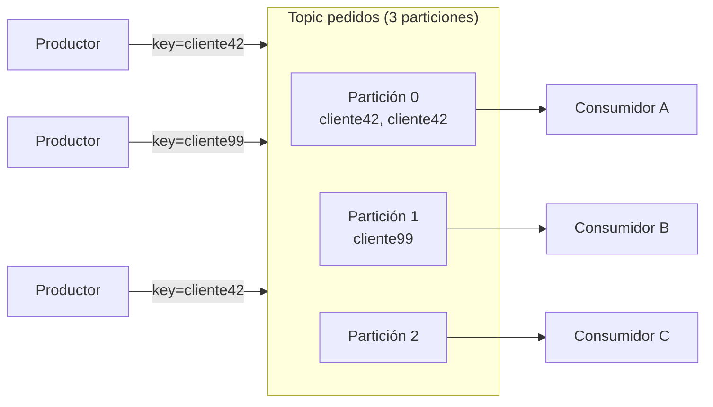

# Tema 2 — Brokers, topics y particiones

[← Anterior: Tema 1 — Event streaming](01-event-streaming.md) · [Índice del bloque ↑](README.md) · [Siguiente: Tema 3 — Consumer groups y offsets →](03-consumer-groups-offsets.md)

---

## Para qué este tema

Pasar de la idea "log distribuido" a **cómo se materializa físicamente** ese log dentro de un cluster Kafka. Sin esto, conceptos como "lag", "rebalanceo" o "réplica fuera del ISR" suenan a magia. Con esto, son consecuencias directas del modelo.

## Idea clave en 30 segundos

> Un **broker** es un proceso Kafka que vive en una máquina (en nuestro caso, un pod). Un **topic** es el "nombre lógico" de un flujo de eventos. Dentro de cada topic, los datos están divididos en **particiones**: trozos independientes del log, cada uno con su propio orden y sus propios offsets. Las particiones se **distribuyen entre los brokers** y se **replican** entre ellos. **La partición es la unidad real de paralelismo, de orden y de tolerancia a fallos en Kafka.**

## Desarrollo

### 1. El broker como pieza física

Un **broker** es:

- Un proceso de servidor Kafka.
- Tiene un **identificador numérico único** dentro del cluster (`broker.id` o asignado).
- Acepta producciones y serve lecturas.
- Tiene **disco propio** donde guarda los logs de las particiones que le tocan.

Un **cluster Kafka** es un conjunto de brokers que se conocen entre sí, comparten metadatos y se reparten la carga. Tres brokers es el mínimo razonable para producción (replicación efectiva); en laboratorio suele haber tres.

> **Talking point:** *"Recordad: en nuestro entorno cada broker es un pod, gestionado por un StatefulSet. Por eso los nombres son estables: kafka-0, kafka-1, kafka-2."*

### 2. El topic como concepto lógico

Un **topic** es una etiqueta de propósito: `pagos`, `pedidos`, `metricas-app-x`. **No existe como entidad física**: lo que existen son sus particiones.

Propiedades clave de un topic, configurables al crearlo:

| Propiedad | Qué controla | Valor habitual |
|-----------|--------------|----------------|
| `partitions` | Número de particiones | Depende del throughput; 3–12 es habitual |
| `replication.factor` | Cuántas copias hay de cada partición | **3** en producción |
| `retention.ms` / `retention.bytes` | Cuánto tiempo / cuánto tamaño conserva | 7 días por defecto |
| `cleanup.policy` | `delete` (borra por edad/tamaño) o `compact` (mantiene última versión por clave) | `delete` por defecto |
| `min.insync.replicas` | Mínimo de réplicas vivas para aceptar escrituras durables | Habitualmente 2 con factor 3 |

Hay otras (segment size, compresión, time index, etc.) que veremos cuando aparezcan; estas cinco son las imprescindibles.

### 3. La partición: la unidad real de Kafka

Cada **partición** de un topic es:

- Un **log independiente**: sus propios mensajes, su propio orden, sus propios offsets (que empiezan en 0).
- **Vive físicamente** en uno o varios brokers (uno *líder* y N *seguidores*; lo veremos en el tema de replicación).
- Es la **unidad mínima** sobre la que se trabaja: producir, consumir, replicar.

Tres ideas para fijar:

1. **El orden se garantiza dentro de una partición, no entre particiones.** Si necesitas orden total entre dos eventos, deben caer en la misma partición.
2. **Cada partición puede ser leída por un solo consumidor del mismo grupo** (lo veremos en el siguiente tema). Esto es lo que limita el paralelismo.
3. **El número de particiones puede ampliarse pero no reducirse fácilmente.** Hay que pensar bien al crear el topic.

### 4. ¿Cómo decide Kafka en qué partición va un mensaje?

El productor decide. Hay tres modos:

- **Con clave**: `partition = hash(key) % num_partitions`. Misma clave → misma partición → mismo orden. Es la opción habitual cuando hay un concepto de "entidad" (cliente, pedido, dispositivo).
- **Sin clave (null) con round-robin "sticky"**: el productor reparte por lotes entre particiones, optimizando batching. Es la opción cuando solo importa balancear carga.
- **Asignación explícita**: el productor decide a mano. Raro fuera de casos avanzados.

> **Conexión con LAB 6:** los participantes van a verlo en vivo. Cambian la clave y ven cómo el mismo evento "cae" siempre en la misma partición; quitan la clave y ven que cae en cualquiera.

### 5. ¿Cuántas particiones poner?

La pregunta que más se repite. No hay una respuesta fija, pero sí criterios:

- **Más particiones = más paralelismo** (más consumidores en un grupo pueden leer a la vez).
- **Más particiones = más overhead** en metadatos, en memoria del broker, en tiempo de recovery, en rebalanceos.
- Una **regla de pulgar** habitual: empezar con el doble de particiones que el máximo número de consumidores que esperas en un grupo. Si tu consumer group escalará a 6 consumidores, un topic con 12 particiones te deja margen.
- En **CFK / Confluent** hay guías concretas; sigue la documentación del operador en producción.

Lo que **no** conviene:

- Crear topics con **una partición** por costumbre: bloquearás el paralelismo de tus consumidores el día que los necesites.
- Crear topics con **miles de particiones** por si acaso: el broker se cansa y los rebalanceos se vuelven dolorosos.

### 6. Producción y consumo: vista lógica

Lo que el diagrama enseña sin decirlo:

- Mensajes con la misma clave (`cliente42`) acaban siempre en la misma partición.
- Cada partición es asignada a un consumidor distinto en un mismo grupo.
- Si hubiera **menos consumidores que particiones**, alguno leería de varias. Si hubiera **más consumidores que particiones**, alguno **quedaría ocioso**.

### 7. Brokers y particiones: el mapa físico

A nivel físico, cada partición tiene:

- Un broker **líder** que sirve todas las lecturas y escrituras.
- N-1 brokers **seguidores** que replican el log del líder.

Los líderes están **distribuidos** entre los brokers para balancear carga. Esto es lo que veremos a fondo en el tema 4 (replicación). De momento basta con la idea: **no existe "el broker dueño del topic"**; un mismo topic tiene sus particiones repartidas.

### 8. Cómo lo vemos desde la CLI

Para anclar (sin entrar todavía a la operación):

- Listar topics: `kafka-topics --bootstrap-server <host> --list`
- Ver detalle de un topic: `kafka-topics --bootstrap-server <host> --describe --topic <t>`
- Crear topic: `kafka-topics --bootstrap-server <host> --create --topic <t> --partitions 6 --replication-factor 3`

El `--describe` es el comando que más se usará en los laboratorios: muestra, para cada partición, quién es líder, quiénes son réplicas, quiénes están "en sync".

## Errores típicos y preguntas frecuentes

- **"¿El topic vive en un broker?"** No. **Las particiones** del topic viven en brokers, repartidas. El topic es un nombre lógico.
- **"¿Una partición = un fichero?"** Internamente la partición se trocea en **segmentos** (archivos). El broker va creando segmentos nuevos y purgando los viejos según la retención. No se necesita más detalle para este curso salvo para diagnóstico avanzado.
- **"¿Puedo reducir el número de particiones?"** No directamente. Solo aumentar. Si te quedas corto y quieres reducir, hay que crear topic nuevo y migrar.
- **"¿Misma clave garantiza siempre el mismo orden?"** Sí, **siempre que no cambies el número de particiones**: el hash cambia el reparto.
- **"¿Pueden dos productores escribir a la misma partición a la vez?"** Sí; el líder de la partición serializa internamente.
- **"¿El orden total existe?"** Sí, **si tienes una sola partición**, a costa de matar el paralelismo. Es un trade-off.

## Puente al siguiente tema

Ya tenemos el modelo físico. La siguiente pregunta es: **¿cómo coordinan varios consumidores la lectura de un topic con muchas particiones, y cómo saben por dónde iban?** Eso lleva a **consumer groups** y **offsets**, los dos conceptos donde más se concentra la operación del día a día.

---

[← Anterior: Tema 1 — Event streaming](01-event-streaming.md) · [Índice del bloque ↑](README.md) · [Siguiente: Tema 3 — Consumer groups y offsets →](03-consumer-groups-offsets.md)
