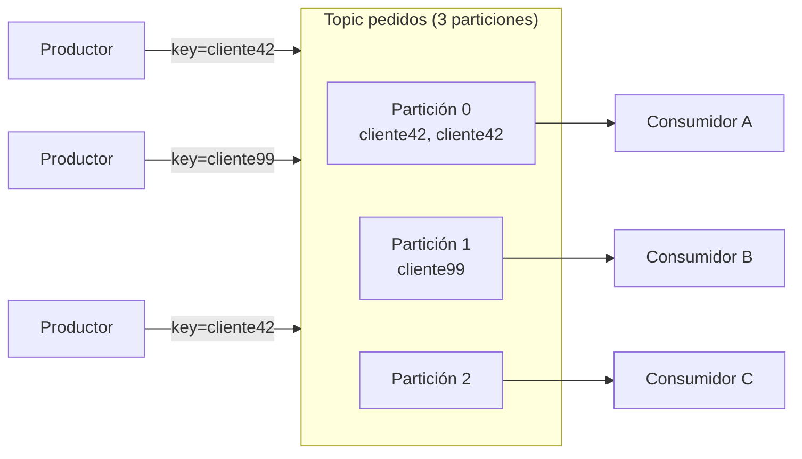

# Brokers, topics y particiones

[← Anterior: Event streaming](01-event-streaming.md) · [Índice del bloque ↑](README.md) · [Siguiente: Consumer groups y offsets →](03-consumer-groups-offsets.md)

---

## En síntesis

Un **broker** es un proceso Kafka que vive en una máquina (en este contexto, un pod). Un **topic** es el nombre lógico de un flujo de eventos. Dentro de cada topic, los datos están divididos en **particiones**: trozos independientes del log, cada uno con su propio orden y sus propios offsets. Las particiones se **distribuyen entre los brokers** y se **replican** entre ellos. **La partición es la unidad real de paralelismo, de orden y de tolerancia a fallos en Kafka.**

## El broker como pieza física

Un **broker** es:

- Un proceso de servidor Kafka.
- Tiene un **identificador numérico único** dentro del cluster (`broker.id` o asignado).
- Acepta producciones y sirve lecturas.
- Tiene **disco propio** donde guarda los logs de las particiones que le tocan.

Un **cluster Kafka** es un conjunto de brokers que se conocen entre sí, comparten metadatos y se reparten la carga. Tres brokers es el mínimo razonable para producción (replicación efectiva); en entornos de prueba suele haber tres.

En un cluster sobre Kubernetes, cada broker es un pod gestionado por un StatefulSet. Por eso los nombres son estables: `kafka-0`, `kafka-1`, `kafka-2`.

## El topic como concepto lógico

Un **topic** es una etiqueta de propósito: `pagos`, `pedidos`, `metricas-app-x`. **No existe como entidad física**: lo que existen son sus particiones.

Propiedades clave de un topic, configurables al crearlo:

| Propiedad | Qué controla | Valor habitual |
|-----------|--------------|----------------|
| `partitions` | Número de particiones | Depende del throughput; 3–12 es habitual |
| `replication.factor` | Cuántas copias hay de cada partición | **3** en producción |
| `retention.ms` / `retention.bytes` | Cuánto tiempo / cuánto tamaño conserva | 7 días por defecto |
| `cleanup.policy` | `delete` (borra por edad/tamaño) o `compact` (mantiene última versión por clave) | `delete` por defecto |
| `min.insync.replicas` | Mínimo de réplicas vivas para aceptar escrituras durables | Habitualmente 2 con factor 3 |

Existen muchas más (segment size, compresión, time index…) que aparecen al necesitarlas; estas cinco son las imprescindibles.

## La partición: la unidad real de Kafka

Cada **partición** de un topic es:

- Un **log independiente**: sus propios mensajes, su propio orden, sus propios offsets (que empiezan en 0).
- **Vive físicamente** en uno o varios brokers (uno *líder* y N *seguidores*).
- Es la **unidad mínima** sobre la que se trabaja: producir, consumir, replicar.

![Diagrama del Topic con tres particiones representadas como filas horizontales: la Partición 0 contiene mensajes con offsets del 01 al 10 y le entra un mensaje nuevo con offset 11; la Partición 1 contiene mensajes del 01 al 08 y le entra el 09; la Partición 2 contiene mensajes del 01 al 09 y le entra el 10. Las flechas a la derecha muestran cómo cada partición recibe el siguiente offset por separado, ilustrando que cada partición es un log independiente con su propia secuencia incremental de offsets](images/particiones-offsets-append.png)

Tres ideas para fijar:

1. **El orden se garantiza dentro de una partición, no entre particiones.** Si hace falta orden total entre dos eventos, deben caer en la misma partición.
2. **Cada partición puede ser leída por un solo consumidor del mismo grupo.** Esto es lo que limita el paralelismo.
3. **El número de particiones puede ampliarse pero no reducirse fácilmente.** Hay que pensar bien al crear el topic.

## ¿Cómo decide Kafka en qué partición va un mensaje?

El productor decide. Hay tres modos:

- **Con clave**: `partition = hash(key) % num_partitions`. Misma clave → misma partición → mismo orden. Es la opción habitual cuando hay un concepto de "entidad" (cliente, pedido, dispositivo).
- **Sin clave (null) con round-robin "sticky"**: el productor reparte por lotes entre particiones, optimizando batching. Es la opción cuando solo importa balancear carga.
- **Asignación explícita**: el productor decide a mano. Raro fuera de casos avanzados.

## ¿Cuántas particiones poner?

No hay una respuesta fija, pero sí criterios:

- **Más particiones = más paralelismo** (más consumidores en un grupo pueden leer a la vez).
- **Más particiones = más overhead** en metadatos, en memoria del broker, en tiempo de recovery, en rebalanceos.
- Una **regla de pulgar** habitual: empezar con el doble de particiones que el máximo número de consumidores que se espera en un grupo. Si un consumer group escalará a 6 consumidores, un topic con 12 particiones deja margen.
- En **Confluent** hay guías concretas; conviene seguir la documentación del operador en producción.

Lo que **no** conviene:

- Crear topics con **una partición** por costumbre: bloqueará el paralelismo del consumidor el día que se necesite.
- Crear topics con **miles de particiones** por si acaso: el broker se cansa y los rebalanceos se vuelven dolorosos.

## Producción y consumo: vista lógica

Lo que el diagrama enseña sin decirlo:

- Mensajes con la misma clave (`cliente42`) acaban siempre en la misma partición.
- Cada partición es asignada a un consumidor distinto en un mismo grupo.
- Si hay **menos consumidores que particiones**, alguno leerá de varias. Si hay **más consumidores que particiones**, alguno **queda ocioso**.

## Brokers y particiones: el mapa físico

A nivel físico, cada partición tiene:

- Un broker **líder** que sirve todas las lecturas y escrituras.
- N-1 brokers **seguidores** que replican el log del líder.

Los líderes están **distribuidos** entre los brokers para balancear carga. Esto se trata a fondo en el capítulo de replicación. De momento basta con la idea: **no existe "el broker dueño del topic"**; un mismo topic tiene sus particiones repartidas.

## Cómo se ve desde la CLI

Para anclar (sin entrar todavía en operación profunda):

- Listar topics: `kafka-topics --bootstrap-server <host> --list`
- Ver detalle de un topic: `kafka-topics --bootstrap-server <host> --describe --topic <t>`
- Crear topic: `kafka-topics --bootstrap-server <host> --create --topic <t> --partitions 6 --replication-factor 3`

El `--describe` es uno de los comandos más usados: muestra, para cada partición, quién es líder, quiénes son réplicas, quiénes están "en sync".

## Preguntas frecuentes

- **¿El topic vive en un broker?** No. **Las particiones** del topic viven en brokers, repartidas. El topic es un nombre lógico.
- **¿Una partición es un fichero?** Internamente la partición se trocea en **segmentos** (archivos). El broker va creando segmentos nuevos y purgando los viejos según la retención. No hace falta más detalle salvo para diagnóstico avanzado.
- **¿Se puede reducir el número de particiones?** No directamente. Solo aumentar. Si se queda corto, hay que crear topic nuevo y migrar.
- **¿Misma clave garantiza siempre el mismo orden?** Sí, **siempre que no cambie el número de particiones**: el hash cambia el reparto.
- **¿Pueden dos productores escribir a la misma partición a la vez?** Sí; el líder de la partición serializa internamente.
- **¿El orden total existe?** Sí, **si hay una sola partición**, a costa de matar el paralelismo. Es un trade-off.

## Lo que viene a continuación

Ya está el modelo físico. La siguiente pregunta es cómo coordinan varios consumidores la lectura de un topic con muchas particiones, y cómo saben por dónde iban. Eso lleva a **consumer groups** y **offsets**.

---

> [!TIP] Laboratorio
>
> **[Lab 6 — Particiones y distribución →](../lab-06-particiones/README.md)**
>
> **Descripción.** Ver cómo se reparten físicamente los mensajes entre las particiones de un topic y qué efecto tiene la clave del mensaje.
>
> **Objetivos**
> - Crear un topic con varias particiones.
> - Enviar mensajes **con clave** y **sin clave** y comparar el reparto.
> - Constatar el orden garantizado dentro de cada partición.
>
> **Encaja con este capítulo** porque toca de manera directa los tres conceptos centrales recién vistos: **broker** (qué pod tiene cada partición), **topic** (nombre lógico) y **partición** (unidad real de orden y paralelismo).

---

[← Anterior: Event streaming](01-event-streaming.md) · [Índice del bloque ↑](README.md) · [Siguiente: Consumer groups y offsets →](03-consumer-groups-offsets.md)
