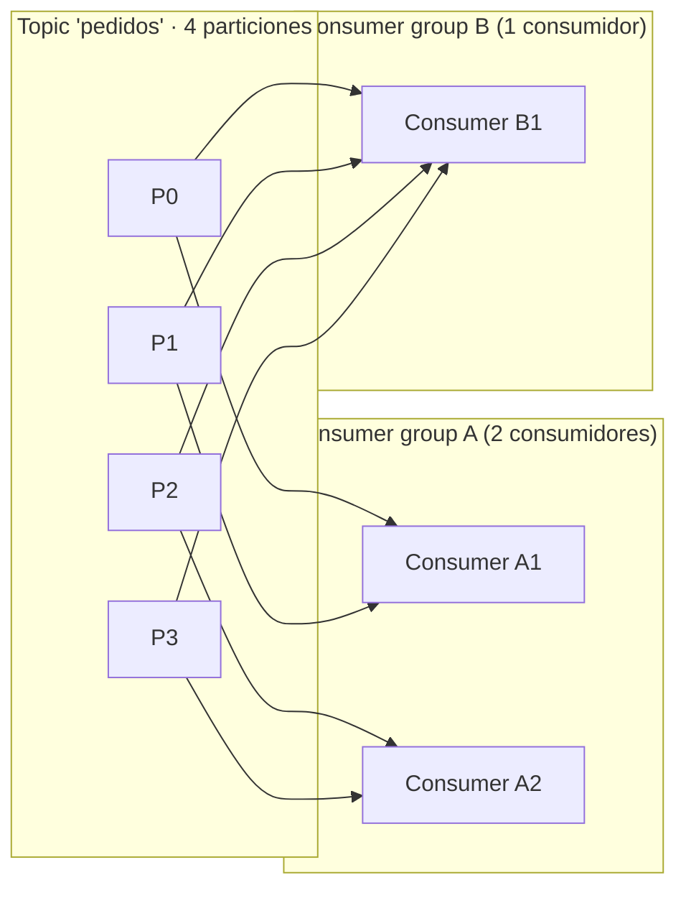

# Consumer groups y offsets

[← Anterior: Brokers, topics y particiones](02-brokers-topics-particiones.md) · [Índice del bloque ↑](README.md) · [Siguiente: Replicación e ISR →](04-replicacion-isr.md)

---

## En síntesis

Varios consumidores pueden colaborar formando un **consumer group**. Kafka **reparte las particiones del topic entre los miembros del grupo**: cada partición la lee **uno y solo uno** del grupo. Cada grupo lleva su **propio offset** (su puntero de lectura) por partición. Otros grupos leen el mismo topic en paralelo con su propio offset. Si cambia la composición del grupo (alguien entra, alguien se cae), se produce un **rebalanceo**: se redistribuyen las particiones. La distancia entre la última posición escrita y la última leída por el grupo se llama **lag**.

## ¿Qué es un consumer group?

Un **consumer group** es un nombre lógico (`group.id`) compartido por **varios procesos consumidores** que quieren cooperar para leer un mismo conjunto de topics.

Reglas básicas:

- Dentro de un grupo, **cada partición se asigna a un único consumidor**. Nunca dos del mismo grupo leen la misma partición.
- Si el grupo tiene **menos consumidores que particiones**, alguno leerá varias.
- Si el grupo tiene **más consumidores que particiones**, los que sobran **están ociosos**.
- Distintos grupos sobre el mismo topic son **independientes**: cada uno con su propio reparto y su propio offset.

El consumer group es la respuesta de Kafka a *"quiero escalar el procesamiento sin perder orden"*: se reparten particiones, cada consumidor procesa lo suyo, el orden se mantiene dentro de cada partición.

## Patrones típicos de uso

Dos casos canónicos que conviene contrastar:

- **Trabajo cooperativo (procesamiento horizontal).** Un solo grupo lee un topic y lo procesa con varios pods. Si se necesita más throughput, se levantan más pods (siempre que haya particiones). Es el caso por defecto para "consumir y hacer algo" en un servicio.
- **Fan-out (varios sistemas lectores).** Cada sistema usa su propio `group.id`. Cada sistema lee **el topic completo** a su ritmo. Es lo que reemplaza a las colas de fan-out clásicas.

![Diagrama de un Kafka Cluster con dos servidores (Server 1 con las particiones P0 y P3, y Server 2 con las particiones P1 y P2) que alimentan a dos consumer groups distintos sobre el mismo topic. El Consumer Group A tiene solo dos consumidores (C1 y C2) y se reparten dos particiones cada uno; el Consumer Group B tiene seis consumidores (C3 a C8) pero, al haber solo cuatro particiones, varios consumidores se quedan sin partición asignada. Ilustra cómo dos grupos leen el mismo topic con repartos completamente independientes](images/consumer-groups-reparto.png)

## Offsets: el puntero por partición

El **offset** es la posición de un mensaje dentro de **su** partición. Empieza en 0 y crece monotónicamente.

Hay que distinguir entre:

- **Log end offset (LEO)** — la última posición escrita (siguiente offset disponible) en la partición.
- **Committed offset** — el último offset que **un grupo** ha marcado como procesado.
- **Current position** — por dónde va el consumidor en este momento (puede no haber commiteado aún).

El **lag** es:

```
lag = LEO − committed offset
```

…por partición. El lag total del grupo es la suma. Si crece sostenidamente, no se procesa al ritmo que se produce. Si oscila pero vuelve a 0, va bien.

## ¿Dónde se guardan los offsets?

En versiones antiguas se guardaban en ZooKeeper. **En Kafka moderno se guardan en un topic interno de Kafka:** `__consumer_offsets`. Esto tiene varias ventajas:

- Son durables y replicados como cualquier topic.
- El propio cluster Kafka es la fuente de verdad; no hay sistema externo que mantener.
- Permite ver el estado con las mismas herramientas.

Cuando un consumidor "commit-ea", lo que hace internamente es **escribir un mensaje** en `__consumer_offsets` que dice *“grupo G, topic T, partición P, offset N”*.

## Cuándo se hace commit: el matiz importante

Hay dos modos:

- **Auto-commit** (`enable.auto.commit=true`, por defecto en muchos clientes): el cliente commit-ea cada cierto tiempo en segundo plano. Cómodo pero peligroso: si el procesamiento falla justo después del commit, se perderán mensajes (commit antes de procesar = "at-most-once").
- **Manual commit**: el código decide cuándo. Lo habitual es **procesar primero y luego commitear**, garantizando "at-least-once" (puede reprocesarse un mensaje si el consumidor cae, pero no perderlo).

El modo por defecto suele ser auto-commit. En producción, casi todo el mundo lo desactiva.

Para garantías más estrictas (exactly-once), Kafka tiene **transacciones**, mencionables aquí únicamente como concepto.

## Reset de offsets: earliest, latest y específico

Cuando un consumer group **arranca por primera vez** (o pierde su offset), tiene que decidir desde dónde empezar:

- `auto.offset.reset = earliest` — desde el principio del log disponible. Útil para procesar histórico o para *bootstrap*.
- `auto.offset.reset = latest` — solo lo que llegue **a partir de ahora**. Útil para "lectores en tiempo real" que no quieren histórico.
- `auto.offset.reset = none` — fallar si no hay offset previo (más estricto).

Resetear offsets de un grupo ya existente requiere la herramienta `kafka-consumer-groups`:

```bash
kafka-consumer-groups --bootstrap-server ... \
  --group mi-grupo --topic pedidos \
  --reset-offsets --to-earliest --execute
```

## Rebalanceo: el momento que más duele

Un **rebalanceo** ocurre cuando cambia la composición del grupo o de los topics:

- Un consumidor **se une** al grupo.
- Un consumidor **se va** (apagado, caída, no responde a heartbeats).
- Cambia el **número de particiones** del topic.
- Cambia el **subscription set** (qué topics consume el grupo).

Durante el rebalanceo, **el grupo deja de consumir** mientras se redistribuyen particiones. En grupos grandes esto puede durar segundos o más, y aparecen **picos de lag**.

Estrategias de asignación (configurables):

- **Range / RoundRobin** — clásicas, fáciles de entender, "stop the world".
- **Sticky / Cooperative Sticky** — minimizan los movimientos: la mayor parte del grupo mantiene sus particiones; solo se mueven las necesarias. Es la opción **recomendada actualmente**.

Un rebalanceo no es un error: es parte de la vida del consumidor. Lo grave es **cuándo** y **cuánto** tardan. Por eso conviene la estrategia cooperativa, heartbeats y `max.poll.interval.ms` bien ajustados.

## Lag: el indicador operativo nº 1

El lag responde a una pregunta de negocio: *¿se está al día?*

Si el lag de un grupo crece y no se recupera:

- Hay menos consumidores de los que el throughput requiere.
- El procesamiento por mensaje es demasiado lento.
- El consumidor está fallando y reintentando.
- Hay un cuello de botella aguas abajo (BBDD, API externa).

La regla mental:

```
lag plano  ≈ todo bien
lag oscilante  ≈ carga variable, normal
lag creciente  ≈ algo va mal
```

## Comandos de bolsillo

Se ejecutan desde el pod **`kafka-cli`** en `app-a` (misma convención que el resto del bloque; ver [Entorno de práctica: pod kafka-cli](../docs/entorno-practica-kafka-cli.md)):

```bash
kubectl -n app-a exec deploy/kafka-cli -- kafka-consumer-groups \
  --bootstrap-server kafka.kafka.svc.cluster.local:9092 --list

kubectl -n app-a exec deploy/kafka-cli -- kafka-consumer-groups \
  --bootstrap-server kafka.kafka.svc.cluster.local:9092 --describe --group mi-grupo
```

Ese último es el comando estrella del operador de Kafka: muestra para cada partición su líder, su offset committed, el LEO y el lag. Es el "kubectl get pods" del mundo Kafka.

## Diagrama: reparto de particiones entre consumidores de un grupo



> Cada grupo lleva su propio reparto y su propio offset. A1 y A2 cooperan; B1 lee solo y lleva todo el peso de su grupo.

## Preguntas frecuentes

- **Si se añade un consumidor al grupo, ¿se lee más rápido?** Solo si hay **particiones libres** que asignarle. Con un topic de 4 particiones, el quinto consumidor del grupo queda ocioso.
- **¿Si dos servicios usan el mismo `group.id` se pisan?** Sí. Comparten reparto y offsets. Si son procesos del mismo servicio, está bien. Si son cosas distintas, **cada uno con su `group.id`**.
- **Lag enorme al arrancar, ¿está mal?** Probablemente el grupo arrancó con `earliest` y está procesando histórico. No es un fallo: el lag se irá comiendo.
- **¿Por qué un consumidor se cae y dispara rebalanceos?** Suele ser `max.poll.interval.ms`: el consumidor tarda más en procesar un lote del que Kafka permite, y el broker lo expulsa.
- **¿Reiniciar el consumidor pierde datos?** No, si se hace commit correctamente. El offset queda en `__consumer_offsets` y al volver se retoma justo donde quedó.

## Lo que viene a continuación

Visto cómo leer en paralelo y cómo recordar por dónde se iba, falta la otra mitad de la robustez de Kafka: qué pasa si un broker se cae. Eso lo cubre **replicación e ISR**.

---

> [!TIP]
> ### Laboratorio
>
> **[Lab 7 — Consumer groups →](../lab-07-consumer-groups/README.md)**
>
> **Descripción.** Trabajar con varios consumidores que cooperan bajo un mismo `group.id` y observar cómo Kafka reparte las particiones entre ellos.
>
> **Objetivos**
> - Levantar varios consumidores en el mismo consumer group.
> - Observar la asignación de particiones a consumidores.
> - Provocar y leer un rebalanceo al añadir o quitar consumidores.
>
> **Encaja con este capítulo** porque materializa la regla central de los grupos: una partición sólo es leída por un consumidor del grupo, y los rebalanceos ocurren cuando cambia la composición.
>
> **Relacionado:** [Lab 8 — Offsets y control de consumo →](../lab-08-offsets/README.md) — gestión de `earliest` / `latest` y reset de offsets.

---

[← Anterior: Brokers, topics y particiones](02-brokers-topics-particiones.md) · [Índice del bloque ↑](README.md) · [Siguiente: Replicación e ISR →](04-replicacion-isr.md)
