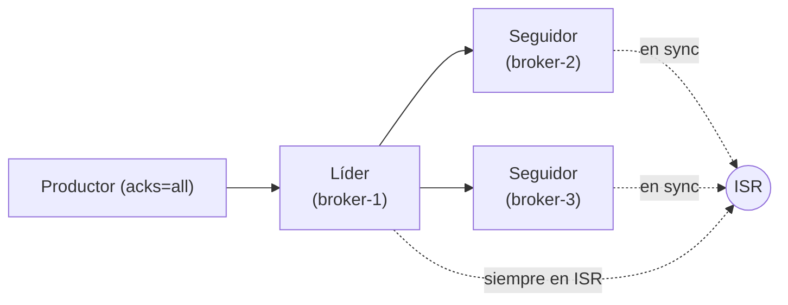

# Replicación, ISR y tolerancia a fallos

[← Anterior: Consumer groups y offsets](03-consumer-groups-offsets.md) · [Índice del bloque ↑](README.md) · [Siguiente: KRaft →](05-kraft.md)

---

## En síntesis

Cada partición se **replica** en varios brokers según el `replication.factor`. Uno de ellos es el **líder** y sirve todas las lecturas y escrituras; los demás son **seguidores** que copian al líder. El conjunto de réplicas que están **al día** se llama **ISR (In-Sync Replicas)**. Las escrituras se consideran durables cuando un mínimo de ISR (`min.insync.replicas`) las han recibido. Si el líder se cae, el controlador elige un **nuevo líder de entre los que están en ISR**. Si no quedan ISR suficientes, las escrituras se bloquean para preservar la durabilidad.

## ¿Qué se replica?

**Particiones**, no topics. Si un topic tiene 3 particiones y factor de replicación 3, **cada partición** existe en 3 brokers (1 líder + 2 seguidores). El reparto se hace de forma que no haya dos réplicas de la misma partición en el mismo broker (no tendría sentido).

Ejemplo intuitivo en un cluster de 3 brokers, topic con 3 particiones y RF=3:

| Partición | Líder | Seguidores |
|-----------|-------|------------|
| 0 | broker-0 | broker-1, broker-2 |
| 1 | broker-1 | broker-0, broker-2 |
| 2 | broker-2 | broker-0, broker-1 |

Los líderes están repartidos para que **ningún broker concentre toda la carga**.

Para visualizar por qué la replicación protege frente a caídas, conviene un ejemplo más pequeño: **3 particiones y replicación 2** sobre 3 brokers. Cada partición tiene un líder en un broker y una copia (réplica) en otro:

![Diagrama "Topics: Replicas III" con cabecera "TopicA — Partitiones 3 — Replicas 2" y una tabla de dos filas y tres columnas que representa lo que vive en cada uno de los tres Kafka Brokers dibujados como cilindros debajo. La primera fila muestra los líderes P0 (azul), P1 (amarillo) y P2 (verde); la segunda fila muestra las réplicas correspondientes: P2 en el broker que lleva P0, P0 en el broker que lleva P1 y P1 en el broker que lleva P2. Ilustra que con replicación 2 cada partición existe en dos brokers distintos](images/replicacion-rf2-ha.png)

Si **cae un broker**, las particiones que tenía como líder pasan a ser servidas por la otra réplica, que se promociona a líder. El cluster sigue funcionando sin pérdida de datos:


Pero si **caen dos brokers a la vez** con factor de replicación 2, alguna partición queda sin ningún broker que la sirva: hay pérdida de disponibilidad parcial.


Regla de pulgar: con replicación N se tolera la pérdida de **N-1 brokers** sin pérdida de servicio para una partición concreta. Por eso **RF=3 es el estándar de producción**.

## Cómo se escribe (el camino de un mensaje)

1. El productor descubre quién es el **líder** de la partición destino (vía metadatos del cluster).
2. Envía el mensaje **solo al líder**.
3. El líder lo añade a su log.
4. Los seguidores **piden** al líder los datos nuevos y los replican en sus propios logs.
5. Cuando suficientes réplicas confirman, el líder responde al productor con el ACK.

El "suficientes" depende del parámetro `acks` del productor:

| `acks` | Significado | Garantía |
|--------|-------------|----------|
| `0` | El productor no espera respuesta | Máxima velocidad, **puede perder datos** |
| `1` | Espera ACK solo del líder | Si el líder se cae antes de replicar, se pierde |
| `all` (o `-1`) | Espera ACK del líder + del mínimo ISR | **Garantía de durabilidad real** |

En producción seria, `acks=all` y `min.insync.replicas=2` con factor 3 es el patrón estándar. Cualquier cosa distinta debe justificarse explícitamente.

## ¿Qué es exactamente el ISR?

**ISR (In-Sync Replicas)** es el conjunto de réplicas (incluido el líder) que están **suficientemente al día** con el líder. "Suficientemente al día" significa que han hecho fetch reciente y no se han quedado atrás más de un umbral (`replica.lag.time.max.ms`, por defecto 30 s en Apache Kafka).

Tres detalles importantes:

- El **líder siempre está en ISR** de su propia partición.
- Un seguidor que se queda muy retrasado **se cae del ISR** automáticamente.
- Si más tarde alcanza al líder, **vuelve al ISR**.

## `min.insync.replicas`: el seguro de durabilidad

Es una propiedad del **topic** (también puede ser global). Si el productor escribe con `acks=all`:

- Kafka acepta la escritura **solo si hay al menos `min.insync.replicas` en el ISR**.
- Si no hay suficientes, devuelve error `NOT_ENOUGH_REPLICAS` al productor.

Lo que esto significa:

- Con RF=3 y `min.insync.replicas=2`: tolera la caída de **1 broker** sin afectar a la escritura. Si caen 2, las escrituras se **bloquean** (mejor parar que aceptar mensajes que pueden perderse).
- Con RF=3 y `min.insync.replicas=1`: tolera la caída de 2, **pero sacrifica garantía**: la escritura con un único nodo vivo puede perderse si ese nodo muere antes de replicarla.

El sistema prefiere caerse antes que aceptar datos que no puede prometer. Por eso a veces aparece la situación *"el productor no puede escribir pero el cluster no está caído del todo"*. Es así por diseño.

## Elección de líder cuando un líder se cae

Cuando el broker que es líder de una partición desaparece:

1. El **controlador** del cluster (visto en KRaft) detecta la baja.
2. Selecciona un **nuevo líder de entre las réplicas que estén en ISR**.
3. Notifica al resto de brokers y a los clientes mediante actualización de metadatos.
4. Los productores y consumidores reanudan operación contra el nuevo líder en cuestión de segundos.

Si **no queda ninguna réplica en ISR**, hay dos caminos posibles:

- **Por defecto (seguro):** la partición queda **sin líder** y no acepta escrituras hasta que vuelva una réplica en ISR.
- **Unclean leader election** (`unclean.leader.election.enable=true`): elegir un seguidor **fuera de ISR** como nuevo líder. Es **rápido pero peligroso**: el nuevo líder puede no tener los últimos mensajes y se **perderán datos**. Está **deshabilitado por defecto** y conviene mantenerlo así salvo casos muy específicos.

> Preferir perder algunos mensajes y seguir escribiendo, o no perderlos y bloquear escrituras: esa decisión es `unclean.leader.election`.

## `under-replicated` y otros indicadores

Al ejecutar `kafka-topics --describe` aparecen líneas como:

```
Topic: pedidos  Partition: 0  Leader: 1  Replicas: 1,2,3  Isr: 1,2,3
Topic: pedidos  Partition: 1  Leader: 2  Replicas: 2,3,1  Isr: 2,3
Topic: pedidos  Partition: 2  Leader: 3  Replicas: 3,1,2  Isr: 3,2,1
```

La **partición 1** tiene `Isr: 2,3` pero `Replicas: 2,3,1` — la réplica 1 **no está en sync**. Eso es una partición **under-replicated**.

Causas habituales:

- Un broker está caído.
- Un broker está saturado y no consigue replicar al ritmo del líder.
- La red entre brokers está degradada.
- Configuración demasiado agresiva (latencias altas, particiones grandes, replicación lenta).

La métrica `UnderReplicatedPartitions > 0` durante un tiempo es **una alerta operativa importante**.

## Otros parámetros prácticos relacionados

- `replica.lag.time.max.ms` — umbral para considerar a un seguidor fuera de sync.
- `default.replication.factor` — factor por defecto de los topics creados.
- `auto.create.topics.enable` — si está activo (no recomendado en producción), los topics se crean con valores por defecto, **que muchas veces no son los correctos**.

## Diagrama: líder, seguidores e ISR



> Solo el líder dialoga con productores/consumidores. Los seguidores hacen *pull* del líder. La pertenencia al ISR depende del retardo. `min.insync.replicas` define cuántos miembros del ISR necesita la escritura.

## Preguntas frecuentes

- **¿Por qué fallan los productores si solo hay un broker caído?** Probablemente hay `acks=all` con `min.insync.replicas=3` y RF=3. Al perder uno, ya no se llega al mínimo. Lo habitual es **RF=3, `min.insync.replicas=2`**.
- **¿Las lecturas también pasan por el líder?** Sí (con configuración estándar). Hay funciones avanzadas (*follower fetching*) para leer desde réplicas cercanas, no tratadas aquí.
- **¿Cuánto tarda en elegirse nuevo líder?** Segundos. Se nota en el throughput durante el fallo; raramente es un parón largo si el cluster está sano.
- **¿Replicación = backup?** **No.** Replicación protege contra **fallos de broker**, no contra **errores humanos** (borrar un topic) ni contra **corrupción de datos**. Backups siguen siendo necesarios en producción.
- **¿Se puede cambiar la replicación de un topic existente?** Sí, con `kafka-reassign-partitions`. No es trivial: hay que generar plan, ejecutarlo y verificarlo. Operación habitual en migraciones.

## Lo que viene a continuación

Falta un componente vital: quién decide quién es líder, quién entra y sale del ISR y quién está vivo. Históricamente lo hacía **ZooKeeper**. En Kafka moderno lo hace **el propio cluster** mediante **KRaft**.

---

[← Anterior: Consumer groups y offsets](03-consumer-groups-offsets.md) · [Índice del bloque ↑](README.md) · [Siguiente: KRaft →](05-kraft.md)
