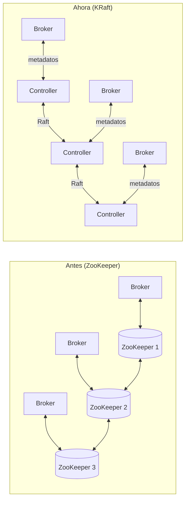

# KRaft: el controlador y el quorum de metadatos

[← Anterior: Replicación e ISR](04-replicacion-isr.md) · [Índice del bloque ↑](README.md) · [Siguiente: Schema Registry →](06-schema-registry.md)

---

## En síntesis

Durante años, Kafka necesitaba **ZooKeeper** para coordinar metadatos del cluster: qué brokers están vivos, quién es líder de qué partición, qué topics existen, qué ACLs hay. Era un sistema externo, otro cluster que mantener, otra cosa que se podía romper. En 2021 empezó a estabilizarse **KRaft**, un mecanismo en el que **los propios brokers** (o nodos dedicados) implementan el consenso usando el algoritmo **Raft**, y los metadatos viven en un topic interno de Kafka. **Menos piezas, mismo modelo lógico**.

## ¿Qué hacía ZooKeeper, exactamente?

Antes de KRaft, ZooKeeper era el "cerebro de control" del cluster Kafka. Guardaba:

- Qué brokers están **vivos**.
- Quién es **el controlador** activo (el líder de control del cluster).
- Quién es líder de cada **partición** y quién está en el **ISR**.
- Qué **topics** existen y su configuración.
- **ACLs**, **quotas** y otros metadatos.

Los brokers eran clientes de ZooKeeper. Si ZooKeeper se rompía, el cluster Kafka no podía hacer cambios (los datos seguían fluyendo en muchos casos, pero la auto-reparación y los cambios se paraban).

Inconvenientes prácticos que motivaron el cambio:

- Operativamente: **dos clusters** (Kafka + ZooKeeper), con sus propios upgrades, copias de seguridad, monitorización.
- Escalabilidad: ZooKeeper tiene un límite práctico de metadatos (~ decenas/centenas de miles de particiones).
- **Reinicio frío** de clusters grandes: tedioso, lento, propenso a errores.

## La idea de KRaft

KRaft (de "Kafka Raft") sustituye a ZooKeeper. Lo importante:

- Hay un subconjunto de nodos que actúan como **controladores** (3 o 5 nodos en producción). Pueden ser dedicados o, en topologías pequeñas, compartidos con brokers.
- Los controladores forman un **quorum** y eligen un **líder** usando el algoritmo **Raft**.
- Los metadatos del cluster se guardan en un **topic interno** especial (`__cluster_metadata`) replicado por Raft.
- Los brokers se suscriben a ese topic y aplican los cambios localmente.

Resultado:

- **Un único cluster**, una única tecnología, mismos protocolos de cliente.
- **Arranque y recuperación más rápidos**.
- **Capacidad para millones de particiones** (muy por encima de lo que la mayoría de organizaciones necesita).

En KRaft, los metadatos son un topic más, replicado por Raft. El control plane usa la misma tecnología que el plano de datos.

## Roles posibles de un nodo

En KRaft, un nodo Kafka puede tener uno o ambos roles:

- **`controller`** — participa en el quorum de metadatos.
- **`broker`** — sirve particiones de datos a clientes.

Combinaciones:

| Configuración | Cuándo se usa |
|---|---|
| Solo `controller` | Producción: nodos dedicados al control plane (3 o 5). |
| Solo `broker` | Producción: nodos dedicados a datos (escalan a la carga). |
| Ambos (mixto) | Despliegues pequeños y entornos de prueba. |

CFK (el operador) configura los roles automáticamente cuando se trabaja en Kubernetes.

## El controlador activo

Aunque varios nodos sean controladores, **solo uno está activo** en cada momento (es el líder de Raft del quorum). Es quien:

- Detecta caídas de broker.
- Reasigna líderes de partición.
- Aplica cambios de configuración del cluster.
- Sirve metadatos al resto.

Si el controlador activo se cae, el quorum **elige otro** automáticamente (en segundos). El cluster sigue funcionando sin intervención humana, igual que antes con ZooKeeper.

## Comprobar el modo y el quorum

Comandos útiles para diagnóstico:

```bash
kafka-metadata-quorum --bootstrap-server <host> describe --status
kafka-metadata-quorum --bootstrap-server <host> describe --replication
```

Muestran:

- Quién es el **líder** del quorum.
- Quiénes son los **votantes** y observadores.
- Cuál es el último offset de metadatos aplicado por cada nodo.

Si un controlador está retrasado, este comando lo evidencia.

## ¿Y los topics y ACLs?

Migran. En clusters Confluent modernos, **todo lo que antes estaba en ZooKeeper ahora está en `__cluster_metadata`**. Las API de cliente no cambian: el mismo `kafka-topics --create` sigue funcionando.

En clusters viejos en modo ZooKeeper, conviene saber que la migración es soportada por Confluent (hay procedimiento documentado), aunque queda fuera del alcance de este texto.

## Cómo afecta esto al despliegue en Kubernetes

Mucho, para bien:

- **Menos StatefulSets**: ya no se despliega un cluster ZooKeeper aparte.
- **Menos servicios, menos secrets, menos monitorización**.
- **Menos cosas que se pueden romper**.

En un cluster real se verán pods de tipo "controller" y "broker", no de "zookeeper".

## Lo que no cambia para quien desarrolla

- El productor sigue siendo el mismo.
- El consumidor sigue siendo el mismo.
- Topics, particiones, consumer groups, offsets, ISR, replicación: **todo igual**.

El cambio es **operativo**, no funcional.

## Diagrama: KRaft frente a ZooKeeper



## Preguntas frecuentes

- **¿Y los scripts viejos que apuntaban a ZooKeeper?** Algunos comandos antiguos llevaban `--zookeeper`. Han pasado a `--bootstrap-server <broker>` desde hace varias versiones. En KRaft **ya no existe** el flag de ZooKeeper.
- **¿Cuántos controladores?** Producción: **3 o 5** (impares, para quórum). Lab o desarrollo: 1 o 3.
- **¿Si se pierde el quorum de controladores?** Los cambios de metadatos quedan en pausa: no se pueden crear topics, ni re-elegir líderes. Los datos en flujo pueden seguir circulando un tiempo, pero conviene recuperar el quorum cuanto antes.
- **¿KRaft cambia el rendimiento?** Mejora el tiempo de recuperación y la escalabilidad de metadatos. En throughput de datos normal, neutro.

## Lo que viene a continuación

Cerrado el núcleo de Kafka (qué es, cómo se reparte, cómo se replica, cómo se coordina), entran los **componentes del ecosistema Confluent** que añaden valor sobre ese núcleo. El primero: **Schema Registry**, pieza que probablemente esté detrás de cualquier integración seria con Kafka.

---

[← Anterior: Replicación e ISR](04-replicacion-isr.md) · [Índice del bloque ↑](README.md) · [Siguiente: Schema Registry →](06-schema-registry.md)
