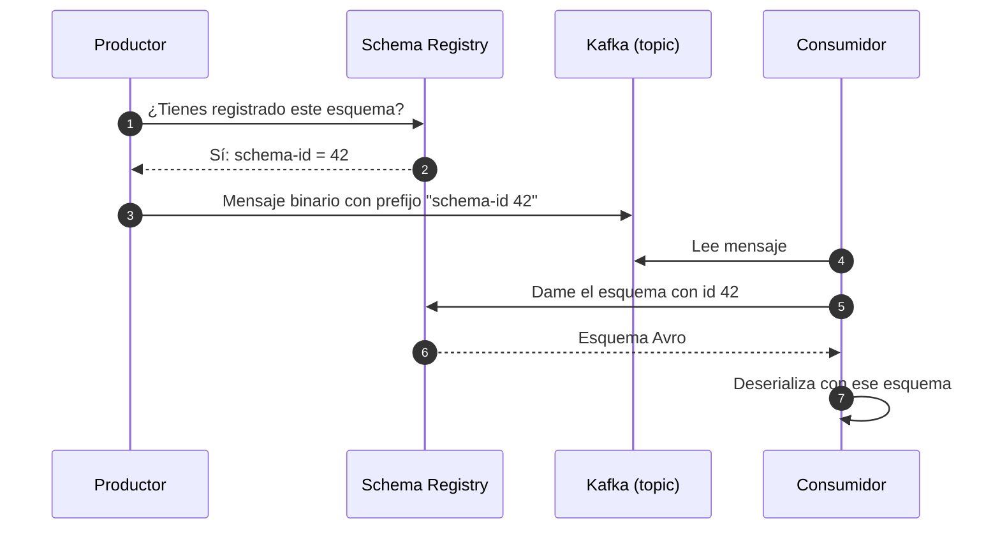

# Schema Registry

[← Anterior: KRaft](05-kraft.md) · [Índice del bloque ↑](README.md) · [Siguiente: Kafka Connect →](07-kafka-connect.md)

---

## En síntesis

**Schema Registry** es un servicio aparte (con su propia API REST) que guarda **esquemas** (definiciones formales de la forma de un mensaje) y los asigna a topics. Los productores **registran** el esquema al enviar mensajes; los consumidores **lo recuperan** para deserializar. Cuando un esquema evoluciona, Schema Registry **valida la compatibilidad** con las versiones anteriores y **rechaza cambios incompatibles**. El formato típico es **Avro**, pero también soporta **JSON Schema** y **Protobuf**.

## El problema sin Schema Registry

Imagina dos servicios:

- Servicio A produce mensajes a `pedidos` con un JSON `{id, importe, divisa}`.
- Servicio B consume `pedidos` y espera ese mismo formato.

Un día A renombra `importe` a `amount`. El servicio A se despliega. **Servicio B se rompe en producción.**

Variantes del mismo drama:

- A elimina un campo y B lo necesitaba.
- A cambia un tipo (`int` → `string`).
- B se actualiza esperando un campo nuevo que A todavía no envía.

Estos errores son **silenciosos** en JSON puro: el productor publica, el consumidor lee, la deserialización funciona, pero el dato no es el que esperaba. Lo peor en aplicaciones reales.

## Esquemas como contrato compartido

Un **esquema** es una definición formal de la forma de los datos: nombres de campos, tipos, opcionalidad, valores por defecto.

Ejemplo (Avro):

```json
{
  "type": "record",
  "name": "Pedido",
  "namespace": "es.curso.kafka",
  "fields": [
    { "name": "id", "type": "string" },
    { "name": "importe", "type": "double" },
    { "name": "divisa", "type": "string", "default": "EUR" }
  ]
}
```

Con un esquema sobre la mesa:

- **El productor** sabe qué tiene que enviar.
- **El consumidor** sabe qué tiene que esperar.
- **El compilador / herramienta** puede generar clases con los campos correctos.
- **Schema Registry** puede comprobar si un cambio es compatible **antes** de aceptarlo.

## Cómo encaja Schema Registry en el flujo



Lo que viaja en el topic **no es JSON ni Avro completo**: es **binario** con un pequeño *header* que dice "este mensaje sigue el esquema X". Eso permite mensajes mucho más compactos y validación fuerte.

En el topic no hay JSON: hay bytes con un identificador de esquema. Para leer hace falta recuperar el esquema. Por eso Schema Registry es **online**: si se cae, deserializar es imposible (aunque normalmente los clientes cachean).

## Subjects y estrategias de nombrado

Schema Registry agrupa esquemas en **subjects**. Un subject suele corresponder a un topic. Hay varias estrategias para nombrarlos:

- **TopicNameStrategy** (la más habitual): un subject por topic, separado para key y value (`pedidos-value`, `pedidos-key`).
- **RecordNameStrategy**: un subject por tipo de record (varias formas de mensaje pueden coexistir en un topic).
- **TopicRecordNameStrategy**: combinación de ambas.

Para empezar es suficiente con la primera.

## Evolución y compatibilidad

Cuando un productor quiere registrar una **versión nueva** del esquema, Schema Registry comprueba que sea **compatible** con las anteriores según una política configurada por subject:

| Política | Significado |
|----------|-------------|
| `BACKWARD` (por defecto) | Un consumidor con la **versión nueva** puede leer datos producidos con la **versión anterior**. Permite borrar campos y añadir opcionales. |
| `FORWARD` | Un consumidor con la versión **anterior** puede leer datos producidos con la nueva. Permite añadir campos requeridos. |
| `FULL` | Ambas a la vez. |
| `NONE` | Cualquier cambio permitido. **No recomendado.** |

Existen también las variantes `*_TRANSITIVE` que aplican la regla **respecto a todas las versiones anteriores**, no solo la inmediata.

`BACKWARD` cubre la mayoría de casos y permite estrategias seguras (consumidor primero, productor después).

## Cuándo se valida la compatibilidad

- Cuando un productor intenta **registrar** un esquema nuevo en Schema Registry, **se valida en ese momento**.
- Si la política se rompe, **el productor recibe un error** y no puede publicar con el nuevo esquema. Buena noticia: **el problema se detecta antes de afectar a consumidores**.

Esto convierte a Schema Registry en un **guardián de la compatibilidad de datos**: hace explícito un contrato que de otra forma queda implícito y se rompe silenciosamente.

## Schema Registry en Kubernetes / CFK

Schema Registry es **otro componente del stack Confluent**:

- Se despliega como una aplicación stateless (un Deployment con varias réplicas).
- Guarda los esquemas en un **topic Kafka** (`_schemas`), no en una base de datos externa. La fuente de verdad es Kafka.
- Expone una **API REST** y normalmente también un puerto HTTP.

En CFK hay un CR (Custom Resource) específico (`SchemaRegistry`) que crea todo el despliegue.

## Formatos: Avro, JSON Schema, Protobuf

Schema Registry soporta los tres:

| Formato | Cuándo se elige |
|---------|----------------|
| **Avro** | El más maduro en el ecosistema Confluent. Mensajes muy compactos. |
| **JSON Schema** | Si la organización ya estandariza en JSON Schema o si la interoperabilidad con frontends es prioritaria. |
| **Protobuf** | Si ya hay infraestructura gRPC / Protobuf y se quiere unificar. |

Los ejemplos suelen darse con **Avro** (el más usado en formación), pero la idea conceptual es idéntica para los otros dos.

## Preguntas frecuentes

- **¿Schema Registry forma parte de Apache Kafka?** No, es **un componente Confluent** (open source, pero del ecosistema Confluent). Apache Kafka por sí solo no lo trae.
- **¿Es obligatorio para usar Kafka?** No. Se pueden producir bytes sueltos, JSON, etc. Pero en cuanto hay **varios equipos** y **versiones distintas** de productores/consumidores, no tenerlo se paga caro.
- **¿Y si se cae?** Los clientes cachean los esquemas que ya han visto. Lo grave es **producir o consumir un esquema nuevo** durante la caída: hasta que vuelva, no se puede.
- **¿Cómo se autentica?** API key/secret en Confluent Cloud, o métodos estándar (TLS mutua, RBAC) en Confluent Platform. Lo configura el operador (CFK).
- **¿Es solo para Avro?** No. JSON Schema y Protobuf están plenamente soportados.
- **¿Afecta al rendimiento?** En estado estacionario, casi nada (lookups cacheados). El primer mensaje paga la latencia de consulta.

## Lo que viene a continuación

Visto cómo **garantizar el contrato** del dato, ahora la otra pieza estrella del ecosistema Confluent: cómo **conectar** Kafka con sistemas externos (bases de datos, ficheros, APIs) **sin escribir código**: **Kafka Connect**.

---

[← Anterior: KRaft](05-kraft.md) · [Índice del bloque ↑](README.md) · [Siguiente: Kafka Connect →](07-kafka-connect.md)
