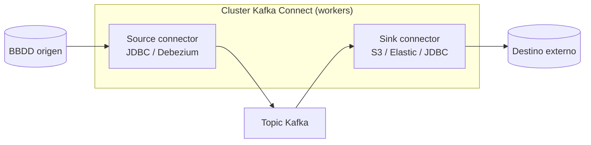

# Tema 7 — Kafka Connect

[← Anterior: Tema 6 — Schema Registry](06-schema-registry.md) · [Índice del bloque ↑](README.md) · [Siguiente: Tema 8 — ksqlDB →](08-ksqldb.md)

---

## Para qué este tema

Mostrar el componente que más rendimiento operativo le saca a Kafka en entornos reales: **Kafka Connect**, el framework para mover datos **hacia** y **desde** Kafka sin código, basado en **conectores** declarativos. Es el motor detrás de pipelines de CDC, integraciones con BBDD, almacenamiento, etc.

## Idea clave en 30 segundos

> **Kafka Connect** es un servicio aparte del cluster Kafka, pensado para **mover datos** entre sistemas externos y topics: **bases de datos, ficheros, APIs, almacenes**. Tiene dos tipos de conectores: **Source** (de fuera a Kafka) y **Sink** (de Kafka a fuera). El operador describe el conector con un JSON, lo envía a la API REST de Connect, y Connect se encarga del trabajo: conexión, paralelismo, offsets, reintentos, errores. **Es lo que evita escribir productores y consumidores caseros para cada integración.**

## Desarrollo

### 1. El problema que resuelve

En cualquier organización con Kafka aparece esta lista:

- "Quiero que cada cambio en mi base de datos se publique a Kafka." → Source CDC.
- "Quiero volcar lo que entra en este topic a S3 / GCS / HDFS." → Sink de almacenamiento.
- "Quiero replicar a otro cluster Kafka." → Source/Sink MirrorMaker 2.
- "Quiero indexar en Elastic todo lo que pase por estos topics." → Sink Elastic.
- "Quiero leer un fichero CSV y meterlo en un topic." → Source de fichero.

Sin Connect, **cada equipo escribe su propio productor o consumidor**: código, tests, despliegue, mantenimiento, monitorización. Cuando hay 30 integraciones, esto es **una segunda plataforma a mantener**.

Connect estandariza el problema: **describe la integración como configuración, no como código.**

### 2. Anatomía de un cluster Connect

Kafka Connect **no se ejecuta dentro de los brokers**. Es un servicio aparte con sus propios nodos (también pods en Kubernetes).

Cada nodo se llama **worker**. Un conjunto de workers forma un **cluster Connect**, identificado por un `group.id` propio (distinto del de un consumer group de tu aplicación).

Lo importante:

- Connect tiene **modo distribuido** (recomendado) y modo standalone (solo para pruebas).
- En modo distribuido, los workers se coordinan a través de Kafka mismo (un puñado de topics internos: `connect-configs`, `connect-offsets`, `connect-status`).
- **No hay base de datos externa**: la configuración, los offsets de cada conector y su estado **viven en topics Kafka**.

### 3. Conectores: source y sink

Un **conector** es la unidad lógica que describes:

- **Source connector** — lee de un sistema externo y publica en topics. Ej.: JDBC Source, Debezium MySQL/Postgres.
- **Sink connector** — lee de topics y escribe en un sistema externo. Ej.: JDBC Sink, S3 Sink, Elasticsearch Sink.

Cada conector se materializa internamente en **tareas (tasks)**: copias paralelas del trabajo. Si el conector lee de una BBDD con 6 tablas y configuras `tasks.max: 6`, Connect puede repartir una tarea por tabla entre los workers disponibles.

Equivalente mental: **conector** = trabajo lógico (qué quiero hacer); **tasks** = paralelismo concreto; **workers** = procesos que ejecutan tasks.

### 4. Cómo se opera Connect

A través de su **API REST**. Los endpoints clave:

| Endpoint | Para qué |
|----------|----------|
| `GET /connectors` | Listar conectores activos |
| `POST /connectors` | Crear uno nuevo (con su JSON de configuración) |
| `GET /connectors/<n>/status` | Ver estado: RUNNING, FAILED, PAUSED |
| `GET /connectors/<n>/tasks` | Ver tasks y su estado |
| `POST /connectors/<n>/restart` | Reintentar tras fallo |
| `DELETE /connectors/<n>` | Eliminar |

Ejemplo de definición de un conector JDBC Source:

```json
{
  "name": "pedidos-cdc",
  "config": {
    "connector.class": "io.confluent.connect.jdbc.JdbcSourceConnector",
    "tasks.max": "1",
    "connection.url": "jdbc:postgresql://db:5432/tienda",
    "connection.user": "kafka",
    "connection.password": "${file:/secrets/db.pwd}",
    "mode": "incrementing",
    "incrementing.column.name": "id",
    "topic.prefix": "pg-",
    "table.whitelist": "pedidos"
  }
}
```

> **Conexión con LAB 12:** este es exactamente el patrón que se ejecuta. Cambiará la base de datos, los nombres y el destino, pero el JSON tiene esta forma.

### 5. Single Message Transforms (SMT)

A veces no basta con "copiar de A a B"; hay que transformar mínimamente cada mensaje: cambiar el nombre de un campo, aplanar estructuras, derivar el topic destino. Connect tiene **SMTs**: pequeñas transformaciones declarativas que se aplican mensaje a mensaje.

Ejemplos:

- `RenameField` — cambiar el nombre de un campo.
- `MaskField` — ocultar un campo (PII).
- `RegexRouter` — derivar el topic destino con regex.
- `Cast` — cambiar tipos.

Las SMT son útiles pero **limitadas**: si la transformación crece, hay que considerar ksqlDB o un procesador Kafka Streams.

### 6. Tolerancia a fallos

Connect está diseñado para reintentar:

- Si un worker se cae, sus tasks se **reasignan** a otros workers del cluster Connect.
- Si una task falla, Connect intenta reiniciarla (con backoff).
- Los **offsets** del conector se persisten en topics internos: tras fallo, el conector retoma justo donde quedó.
- Para errores de mensaje (registro corrupto), hay políticas configurables (`errors.tolerance`, `errors.deadletterqueue.topic.name`) para no parar el conector entero por un mensaje malformado.

### 7. Connect y Schema Registry

Casi siempre van juntos. Connect serializa/deserializa usando **converters**:

- `StringConverter` / `JsonConverter` — sin Schema Registry.
- `AvroConverter` / `JsonSchemaConverter` / `ProtobufConverter` — **con Schema Registry**.

Para un pipeline serio (con compatibilidad y validación), el converter va contra Schema Registry. Es la combinación habitual en Confluent.

### 8. Cluster Connect en Kubernetes / CFK

En CFK hay un CR `Connect` que crea un Deployment de workers con su configuración (qué cluster Kafka usar, qué imagen de Connect, qué plugins). Los **conectores en sí** se crean con otro CR (`Connector`) o vía API REST.

Patrón limpio:

- **Infra (workers)** la gestiona CFK con el CR `Connect`.
- **Conectores concretos** los gestiona el equipo dueño del pipeline, vía API REST o CR `Connector`.

## Diagrama



## Errores típicos y preguntas frecuentes

- **"¿Connect es un cluster aparte?"** Sí. No vive dentro de los brokers. En Kubernetes son **pods diferentes** (típicamente un Deployment con N réplicas).
- **"¿Pongo todos mis conectores en un cluster Connect?"** Para pocos integraciones, sí. Cuando hay muchos equipos y muchos conectores con perfiles distintos (tráfico alto vs. ligero, conectores caseros vs. estándar), conviene **varios clusters Connect** especializados.
- **"¿Tengo que escribir Java?"** Para usar conectores existentes, **no**. Para desarrollar uno nuevo desde cero, sí. La mayoría de los casos están cubiertos por el catálogo de Confluent Hub.
- **"¿Y la seguridad de credenciales?"** Connect soporta proveedores externos de configuración (variables, ficheros, Vault) para no meter contraseñas en el JSON. En el LAB 12 lo veremos.
- **"¿Connect es síncrono o asíncrono?"** Asíncrono y batch. Los conectores hacen *polling* (source) o *batch* (sink) en ciclos configurables.

## Puente al siguiente tema

Connect mueve datos sin transformarlos mucho. Cuando necesitamos **filtrar, agregar, unir y derivar** flujos en tiempo real con un lenguaje conocido (SQL), entra **ksqlDB**, que es el siguiente tema.

---

[← Anterior: Tema 6 — Schema Registry](06-schema-registry.md) · [Índice del bloque ↑](README.md) · [Siguiente: Tema 8 — ksqlDB →](08-ksqldb.md)
