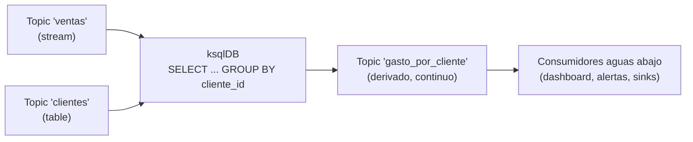

# Introducción a ksqlDB

[← Anterior: Kafka Connect](07-kafka-connect.md) · [Índice del bloque ↑](README.md) · [Siguiente: Operadores y CFK →](09-operadores-cfk.md)

---

## En síntesis

**ksqlDB** es un motor de procesamiento de streams que se programa con un dialecto de **SQL**. Permite leer topics como si fueran tablas o flujos, transformar, filtrar, agregar, unir y escribir el resultado en otros topics, sin escribir Java. Por debajo, ksqlDB usa **Kafka Streams**: las consultas se traducen a topologías de procesamiento que corren en sus propios servidores. El resultado de una consulta puede ser **persistente** (un nuevo stream/table mantenido continuamente) o **interactivo** (una query puntual).

## Por qué SQL sobre Kafka

Las operaciones más comunes sobre un stream **se parecen mucho** a SQL:

- Filtrar eventos: `WHERE`.
- Proyectar campos: `SELECT col1, col2`.
- Agrupar y contar: `GROUP BY`.
- Unir dos flujos: `JOIN`.
- Materializar el "último estado" por clave: `GROUP BY` con `LAST_VALUE`.

Implementar esto a mano con productores y consumidores es viable, pero **repetitivo y propenso a errores**. ksqlDB es la forma de tenerlo declarativo.

## Streams vs Tables

Es el concepto central de ksqlDB (y de Kafka Streams). Sobre un topic se puede mirar de dos formas:

- **Stream** — secuencia de eventos. Cada evento es un hecho independiente. Ejemplo: `ventas` — cada record es una venta.
- **Table** — estado actual por clave. Para cada clave única, el "valor" de la tabla es el **último** evento con esa clave. Ejemplo: `clientes` — el último record de cada `cliente_id` define el estado actual del cliente.

Ejemplo declarativo:

```sql
CREATE STREAM ventas (
    venta_id STRING KEY,
    cliente_id STRING,
    importe DOUBLE
) WITH (KAFKA_TOPIC='ventas', VALUE_FORMAT='JSON');

CREATE TABLE clientes (
    cliente_id STRING PRIMARY KEY,
    nombre STRING,
    email STRING
) WITH (KAFKA_TOPIC='clientes', VALUE_FORMAT='JSON');
```

A partir de aquí, se pueden consultar como en SQL convencional, con la ventaja de que **los datos siguen llegando**: las consultas se actualizan continuamente.

## Tipos de consultas

ksqlDB distingue dos modalidades:

- **Push queries** (consultas continuas):
  ```sql
  SELECT cliente_id, SUM(importe) AS gasto
  FROM ventas
  GROUP BY cliente_id
  EMIT CHANGES;
  ```
  El resultado se va emitiendo conforme entran datos. Es el patrón clásico de stream processing.
- **Pull queries** (consultas puntuales sobre el estado):
  ```sql
  SELECT gasto FROM clientes_totalizados WHERE cliente_id = 'C001';
  ```
  Devuelve el valor actual y termina, como una consulta de base de datos.

Para que las pull queries funcionen, ksqlDB **materializa** las tablas internamente (no consulta directamente Kafka; consulta el estado local que mantiene Kafka Streams).

## ksqlDB como cluster

Los servidores ksqlDB se despliegan como un **cluster** (uno o más nodos). Comparten un `ksql.service.id` que identifica el grupo. Internamente:

- Cada query persistente creada se traduce en una **aplicación Kafka Streams** que corre en el cluster.
- El estado local se replica entre nodos para tolerancia a fallos.
- La interfaz puede ser **CLI**, **REST API** o el **Confluent Control Center**.

En Kubernetes (CFK) hay un CR `KsqlDB` que despliega el cluster. Es similar en estructura a Connect: Deployment con varias réplicas.

## Casos de uso típicos

- **Enriquecimiento**: unir un stream de eventos con una tabla de referencia (`JOIN` stream-table).
- **Agregaciones en ventana**: contar/sumar por minuto, por hora, por día.
- **Detección de patrones**: filtrar eventos que cumplen condiciones (alertas).
- **Topics derivados**: a partir de uno crudo, generar uno limpio o estructurado para otros consumidores.

## ¿Cuándo conviene ksqlDB y cuándo no?

**Conviene cuando**:

- La lógica es **claramente expresable en SQL** (filtros, joins, agregaciones).
- Se prefiere mantener consultas SQL antes que código Java.
- Se quieren ver resultados rápidamente sin desplegar pipelines complejos.

**No es la mejor opción cuando**:

- La lógica es muy procedimental o usa estructuras complejas.
- Hacen falta garantías muy específicas que solo da código a medida con Kafka Streams.
- El equipo ya tiene experiencia con Streams / Flink y prefiere ese camino.

ksqlDB es la forma rápida y declarativa. Kafka Streams es la forma flexible y programática. Ambas usan la misma base por debajo.

## Relación con Connect y Schema Registry

- **Schema Registry**: ksqlDB lo usa para entender el esquema de los topics que lee. Sin él, hay que declarar el esquema en el `CREATE STREAM/TABLE`.
- **Connect**: ksqlDB puede *crear conectores Connect* desde su propia sintaxis (`CREATE SOURCE CONNECTOR ...`), si la API de Connect es accesible.

El conjunto **Connect + Schema Registry + ksqlDB** sobre Kafka es la "Confluent Platform completa" desde el punto de vista de procesamiento. No es necesario tenerlo todo: cada pieza se introduce cuando aparece su necesidad.

## Limitaciones a tener presentes

- ksqlDB no es una base de datos para consultas analíticas complejas. Para *analytics ad hoc* sobre histórico, lo natural es volcar a un almacén (S3, BigQuery) y consultar allí.
- Las **ventanas temporales** y los **joins entre dos streams** tienen limitaciones (retención de buffers, late events) que conviene entender al construir pipelines serios.
- Como cualquier sistema con estado, **el almacenamiento local de los nodos importa**: en Kubernetes, suele ir con `PersistentVolumeClaim`.

## Diagrama: una consulta ksqlDB en el pipeline



## Preguntas frecuentes

- **¿ksqlDB es una base de datos?** Tiene "DB" en el nombre y soporta pull queries, pero está optimizada para **procesar streams**, no para ser un almacén general. No conviene usarla como BBDD aplicacional.
- **¿Es solo de Confluent?** Es un proyecto Confluent (open source). No forma parte de Apache Kafka.
- **¿Hace falta ksqlDB para producir y consumir?** No. Es una capa opcional **sobre** Kafka.
- **¿Hay alternativas?** Sí: **Kafka Streams** (Java, programático), **Apache Flink**, **Spark Structured Streaming**. La elección depende del equipo y de la complejidad del problema.
- **¿Y para SQL más amplio sobre Kafka?** Hay alternativas analíticas (Trino, ClickHouse) que conectan a Kafka o a sus salidas; quedan fuera del alcance de este texto.

## Lo que viene a continuación

Recorrido el ecosistema Confluent (Schema Registry para contratos, Connect para integraciones, ksqlDB para procesamiento), queda explicar cómo se **despliega y mantiene** todo este stack en Kubernetes: **operadores** y, en concreto, **CFK (Confluent for Kubernetes)**.

---

<div align="center">

### Laboratorio !!

[**Lab 12 — Kafka Connect (JDBC → Kafka) →**](../lab-12-kafka-connect/README.md)

*ksqlDB no tiene laboratorio dedicado en el programa; la práctica de integración del bloque es Connect (Lab 12).*

</div>

---

[← Anterior: Kafka Connect](07-kafka-connect.md) · [Índice del bloque ↑](README.md) · [Siguiente: Operadores y CFK →](09-operadores-cfk.md)
