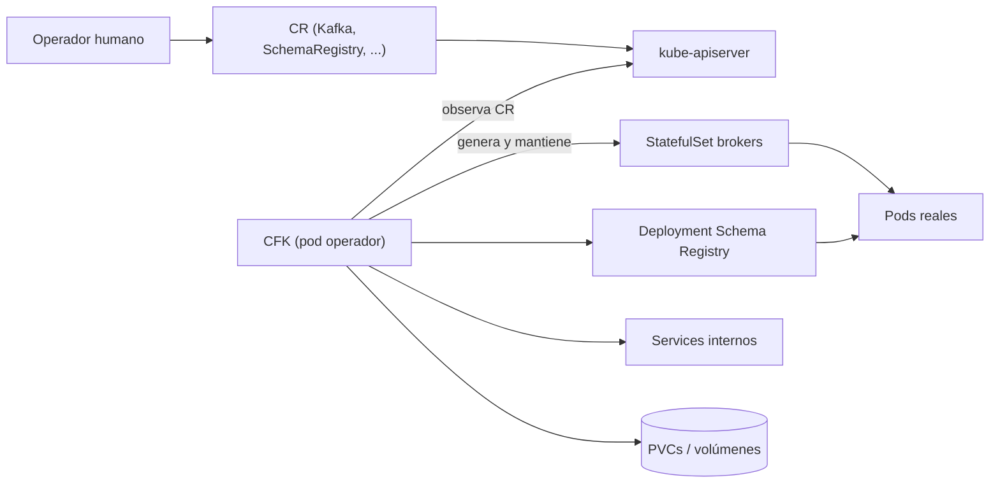

# Tema 9 — Operadores y CFK (Confluent for Kubernetes)

[← Anterior: Tema 8 — ksqlDB](08-ksqldb.md) · [Índice del bloque ↑](README.md) · [Siguiente: Bloque 3 — Integración →](../../bloque-3-integracion/fundamentos/README.md)

---

## Para qué este tema

Conectar el bloque de Kafka con el de Kubernetes: **¿cómo se despliega y opera todo este stack en Kubernetes sin volver loco al equipo?** La respuesta del ecosistema Confluent es **CFK**, un **operador** que automatiza el ciclo de vida completo. Este tema es el puente al bloque 3.

## Idea clave en 30 segundos

> Un **operador de Kubernetes** es un controlador especializado que entiende **un dominio de aplicación** (en este caso, Kafka y el resto de la plataforma Confluent). Le declaras lo que quieres (*"un cluster Kafka de 3 brokers con TLS y Schema Registry replicado"*) mediante recursos personalizados (CRDs), y el operador genera y mantiene **todos** los objetos Kubernetes necesarios: StatefulSets, Services, ConfigMaps, Secrets, certificados, volúmenes. **CFK** es el operador oficial de Confluent.

## Desarrollo

### 1. Recordatorio: el patrón "operador"

En Kubernetes, un **controlador** es un proceso que mira el clúster, compara estado deseado con real y actúa. Los controladores nativos (Deployment, ReplicaSet, StatefulSet) saben gestionar objetos genéricos.

Un **operador** es lo mismo pero para una **aplicación concreta**: entiende su lógica de negocio (que en un cluster Kafka añadir un broker no es trivial, que actualizar un broker requiere cuidar la replicación, etc.).

Los operadores se basan en:

- **CRDs (Custom Resource Definitions)**: extienden la API de Kubernetes con tipos nuevos (p. ej. `Kafka`, `KafkaTopic`, `SchemaRegistry`). Para el clúster son objetos como cualquier otro.
- **Custom Resources (CRs)**: instancias concretas de esos CRDs.
- **Un pod controlador** (el operador propiamente dicho) que observa los CRs y reconcilia.

> **Analogía:** *"Un Deployment es como un cocinero que sabe hacer un plato genérico. Un operador es un chef especializado que sabe cocinar **paella**: conoce los tiempos del sofrito, cuándo añadir el caldo y cuándo apagar el fuego."*

### 2. ¿Qué hace CFK por nosotros?

CFK aporta un conjunto de CRDs para describir un cluster Confluent completo. Los más relevantes:

| CRD | Qué representa |
|-----|----------------|
| `Kafka` | El cluster Kafka (brokers + controladores). |
| `KafkaRestProxy` | REST Proxy de Confluent. |
| `SchemaRegistry` | Servicio Schema Registry. |
| `Connect` | Cluster Kafka Connect (workers). |
| `Connector` | Conector concreto dentro de Connect. |
| `KsqlDB` | Cluster ksqlDB. |
| `ControlCenter` | Confluent Control Center (UI). |
| `KafkaTopic` | Un topic gestionado declarativamente. |
| `Zookeeper` | (solo si se usa modo ZK; en KRaft no aparece) |

Cuando aplicas uno de estos CRs, **CFK** se encarga de:

- Crear el StatefulSet correspondiente.
- Configurar los listeners, TLS, autenticación.
- Generar Services para el descubrimiento.
- Montar configuraciones en ConfigMaps y secrets adecuados.
- Aplicar rolling updates **respetando el quórum y la replicación**.
- Reaccionar ante caídas y desviaciones.

> **Talking point:** *"El operador es lo que convierte un YAML de tres pantallas en un cluster Kafka con todo el cableado interno. Sin operador, todo eso lo tendrías que escribir y mantener tú."*

### 3. Una operación clave: rolling update de los brokers

Un upgrade ingenuo de un cluster Kafka es un desastre: bajar y subir brokers sin orden corta líderes, deja particiones sin ISR y puede provocar pérdida de datos. CFK orquesta esto:

1. Selecciona el broker a actualizar.
2. **Espera** a que el broker esté en estado seguro (líderes movidos, ISR sano).
3. Lo baja, aplica el cambio, lo levanta.
4. **Espera** a que se reincorpore al ISR y recupere su parte de líderes.
5. **Pasa al siguiente broker.**

Esto, hecho a mano, es lento y propenso a error. Es un ejemplo de lo que un operador especializado aporta sobre un StatefulSet genérico.

### 4. Topología típica que verás en el LAB 13

Un cluster Confluent en Kubernetes con CFK acaba teniendo, como mínimo:

- 3 pods **broker** (StatefulSet).
- 3 pods **controller** KRaft (StatefulSet) — o nodos mixtos en topologías pequeñas.
- 2 pods **Schema Registry** (Deployment).
- 2 pods **Kafka Connect workers** (Deployment).
- 1+ pods **ksqlDB** (Deployment, opcional).
- 1+ pods **Control Center** (Deployment, opcional).
- 1 pod **operador CFK** (Deployment).
- Services para cada componente.
- Volúmenes persistentes para los brokers y otros componentes con estado.

Eso es lo que veremos en `kubectl get pods` durante el laboratorio. No hay que tenerle miedo a la cantidad: cada pod tiene una función reconocible.

### 5. Beneficios concretos en producción

- **Repetibilidad.** Lo que define el cluster es **YAML versionado**, no clicks o procedimientos.
- **Estandarización.** Todos los clusters de la organización siguen el mismo patrón.
- **Operación segura.** El operador conoce el dominio: upgrades, reescalados, rotaciones de certificados.
- **Integración con K8s.** Métricas vía Prometheus, logs por stdout (a tu solución central), networking unificado.
- **Soporte.** En entornos enterprise, Confluent soporta CFK y sus integraciones.

### 6. Limitaciones y cosas a saber

- **No es magia.** Sigues necesitando entender qué hace Kafka. Si el cluster pierde quórum, el operador no lo arregla sin tu ayuda.
- **Es un componente más.** El propio CFK puede tener bugs, hay que actualizarlo, vigilar sus logs y mantener la versión coordinada con la versión de Confluent Platform que despliega.
- **Stateful en Kubernetes sigue siendo serio.** Los brokers requieren almacenamiento persistente con buen rendimiento; no vale cualquier StorageClass.

### 7. Diferencias con otros operadores que oirás nombrar

Hay otros operadores en el ecosistema:

- **Strimzi** — operador open source para Apache Kafka. Muy popular fuera de entornos Confluent. Si en tu organización no hay licencia Confluent, suele ser la opción.
- **Confluent for Kubernetes (CFK)** — el que veremos. Específico de Confluent Platform; incluye los CRDs para todo el ecosistema (Schema Registry, Connect, etc.).
- **Operadores propios o de cloud provider** — menos habituales.

A efectos de este curso: **CFK**. Pero el patrón conceptual (CRDs + operador) es idéntico en todos los casos.

### 8. ¿Cómo se instala CFK?

Resumido:

1. Se instalan los CRDs.
2. Se despliega el operador (típicamente con un **Helm chart** oficial).
3. Se crea un namespace de trabajo (`kafka`, `confluent`, etc.).
4. A partir de ahí ya puedes aplicar CRs como `Kafka`, `SchemaRegistry`, etc.

En el LAB 13 los participantes inspeccionarán un cluster ya instalado; **no instalan ellos el operador**. Lo importante es saber leer el resultado.

## Diagrama: el operador en acción

## Errores típicos y preguntas frecuentes

- **"¿Sin CFK no puedo correr Kafka en K8s?"** Puedes, pero acabas escribiendo y manteniendo a mano lo que CFK ya hace. Para producción seria, el operador casi siempre vale la pena.
- **"¿Por qué brokers son StatefulSet y no Deployment?"** Porque cada broker tiene **identidad** (nombre estable: `kafka-0`, `kafka-1`...) y **volumen propio**. Esto lo vimos en el Bloque 1, tema 5.
- **"¿El operador toca mis topics?"** Solo si los declaras como `KafkaTopic` (CR). Si los creas con `kafka-topics` desde la CLI, son **invisibles** para CFK: opera el cluster, no los topics.
- **"¿Puedo mezclar Strimzi y CFK?"** Técnicamente no: cada operador asume que es dueño del cluster que gestiona. En un mismo K8s pueden coexistir si gestionan namespaces distintos, pero **el mismo cluster Kafka solo lo opera un operador**.
- **"¿Y la migración de clusters viejos?"** Hay procedimientos documentados de Confluent. No están en el alcance del curso.

## Cierre del bloque 2

Hasta aquí los **fundamentos teóricos** del bloque 2. Si los participantes asimilan:

- Modelo de log distribuido.
- Brokers, topics, particiones, claves.
- Consumer groups, offsets, lag y rebalanceos.
- Replicación, ISR, `acks` y `min.insync.replicas`.
- KRaft y rol de los controladores.
- Schema Registry, Connect y ksqlDB como ecosistema.
- Operadores y CFK.

…entonces los laboratorios 5–12 son **aplicación práctica** de cosas ya conocidas, y el bloque 3 (integración con Kubernetes) cierra el círculo con sentido completo.

---

[← Anterior: Tema 8 — ksqlDB](08-ksqldb.md) · [Índice del bloque ↑](README.md) · [Siguiente: Bloque 3 — Integración →](../../bloque-3-integracion/fundamentos/README.md)
