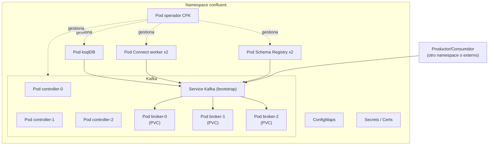

# Kafka operado en Kubernetes (síntesis)

[← Índice del bloque](README.md) · [Siguiente: Pipeline extremo a extremo →](02-pipeline-extremo-a-extremo.md)

---

## En síntesis

Un cluster Confluent en Kubernetes es **un caso particular de aplicación stateful**: brokers como **StatefulSet** con identidad y volumen propio, **Services** internos para el descubrimiento, **ConfigMaps y Secrets** para configuración y credenciales, **PersistentVolumeClaims** para los datos. Sobre eso, el operador **CFK** ofrece la lógica específica de Kafka (rolling updates seguros, gestión del quorum, certificados, escalado). Diagnosticar un broker no se diferencia esencialmente de diagnosticar cualquier otra app en K8s: **`describe pod`, eventos, logs, probes** — más el `describe topic` ya conocido.

## La foto completa, pieza a pieza

Sobre un namespace de trabajo (típicamente `confluent` o `kafka`), CFK crea:

| Pieza de K8s | Para qué la usa Kafka |
|--------------|----------------------|
| **StatefulSet** | Brokers y controladores: identidad estable, orden de arranque, volumen propio. |
| **Headless Service** | Resolución DNS por pod (`kafka-0.kafka...`). Imprescindible para que cada broker tenga un nombre único alcanzable. |
| **ClusterIP Service** | Bootstrap del cliente (un único nombre como punto de entrada). |
| **PVC + StorageClass** | Almacenamiento durable para el log de cada broker. |
| **ConfigMap** | Plantillas de configuración de Kafka y resto de componentes. |
| **Secret** | Credenciales, certificados, claves. |
| **Deployment** | Componentes stateless: Schema Registry, Connect, ksqlDB, Control Center, operador CFK. |
| **CRDs (CFK)** | `Kafka`, `SchemaRegistry`, `Connect`, `KafkaTopic`, etc. |

Si se quitan los CRDs específicos, lo demás es K8s estándar. CFK añade la lógica de orquestación que Kafka necesita por encima.

## ¿Por qué StatefulSet y no Deployment para los brokers?

Tres motivos:

- **Identidad estable.** El broker 1 es siempre el broker 1, con el mismo nombre DNS. Si fuera Deployment, los pods serían intercambiables: `app-7c9-xyz` hoy, `app-3a4-abc` mañana. Inservible para un cluster Kafka.
- **Volumen propio.** Cada broker tiene **su log** en un PVC dedicado. Si el pod cae, el nuevo se reasocia al mismo volumen y recupera el estado.
- **Orden de arranque.** Los brokers arrancan en orden (`-0`, `-1`, `-2`); útil para inicialización segura del cluster.

## Servicios y exposición

El **descubrimiento interno** entre brokers usa un **headless Service**: cada broker se llama `kafka-0.kafka-internal.namespace.svc.cluster.local`. Esto se ve directamente con `kubectl get svc` y `kubectl exec` a un pod para hacer `nslookup`.

Para los **clientes** (productores y consumidores) hay normalmente:

- Un **bootstrap interno**: un Service tipo ClusterIP al que apuntan los clientes que viven dentro del cluster.
- Un **bootstrap externo**: opcional, según la organización (LoadBalancer, Ingress, NodePort) si hay clientes fuera del cluster K8s.

CFK simplifica todo esto: se declaran los **listeners** que se quieren y el operador crea los Services correspondientes.

## Almacenamiento: la decisión que importa

El log de Kafka es **stateful**. Cada partición vive en disco. Conclusión: **la calidad del StorageClass importa**.

Aspectos a recordar:

- **Persistencia** real: el PVC debe sobrevivir a reinicios del pod.
- **Rendimiento**: SSD/NVMe local o cloud-native rápido. Discos lentos son veneno para un cluster Kafka serio.
- **No se comparte**: cada broker tiene su PVC. No es un volumen compartido tipo NFS para todos los brokers.
- **Reaccionar a `PVC pending`**: si el StorageClass no aprovisiona, los brokers no arrancan. Es de las primeras cosas a mirar en una incidencia.

## Diagnosticar un cluster Kafka en K8s: dos capas

Cuando algo va mal, hay que pensar en **dos planos**:

- **Plano Kubernetes** — ¿están los pods *Running*? ¿Hay *CrashLoopBackOff*? ¿*ImagePullBackOff*? ¿*Pending* por falta de recursos o PVC? ¿Las *probes* fallan? Esto se mira con `kubectl describe pod`, `kubectl logs`, `kubectl get events`.
- **Plano Kafka** — ¿están los brokers vivos según el cluster? ¿El ISR está sano? ¿Hay particiones *under-replicated*? ¿El quorum KRaft está bien? Esto se mira con `kafka-topics --describe`, `kafka-metadata-quorum`, métricas.

Un broker puede estar 'Running' en Kubernetes y 'fuera del ISR' en Kafka. Las dos cosas son verdad, y por eso miran las dos capas.

## Operaciones cotidianas en este montaje

| Tarea | Capa | Cómo |
|-------|------|------|
| Levantar / bajar el cluster | K8s + CFK | Modificar CR `Kafka` (réplicas, recursos). |
| Crear un topic | Kafka (o CFK) | `kafka-topics --create ...` o CR `KafkaTopic`. |
| Cambiar retención de un topic | Kafka | `kafka-configs --alter ...`. |
| Ver consumer groups y lag | Kafka | `kafka-consumer-groups --describe ...`. |
| Reiniciar un broker | K8s | `kubectl delete pod kafka-N` (StatefulSet lo recrea). |
| Reemplazar un broker | K8s + CFK | Reescalar StatefulSet vía CR; CFK reasigna. |
| Rotar certificados | CFK | El operador gestiona la rotación al cambiar el secreto. |
| Ver logs de un broker | K8s | `kubectl logs -f kafka-0`. |

## Lo que no cambia respecto a Kafka tradicional

- El protocolo de Kafka es el mismo.
- Los productores y consumidores **no saben ni les importa** que el cluster esté en K8s.
- El **bootstrap.servers** apunta a un nombre DNS: ya sea un Service interno en K8s o un balancer externo, para el cliente es transparente.
- Todo lo aprendido en el bloque 2 sobre topics, particiones, ISR y consumer groups **se aplica idéntico**.

## Connect, Schema Registry y ksqlDB en este escenario

Como aplicaciones **stateless** (en su mayoría), se despliegan con **Deployments** vía CRs específicos de CFK:

- **Schema Registry** — Deployment de varias réplicas; los datos viven en un topic Kafka, no en disco propio.
- **Connect** — Deployment de workers; los offsets de conectores viven en topics Kafka.
- **ksqlDB** — Deployment con almacenamiento local opcional (para estado de streams); si lo usa, va con PVCs.

Todos consumen el cluster Kafka como bootstrap, y Schema Registry como contrato. Es el mismo patrón ya conocido, solo que cada cuadro del diagrama es un Deployment en K8s con su Service y su CR.

## Diagrama: el cluster completo en K8s

## Preguntas frecuentes

- **¿Un broker se puede mover de nodo K8s sin perder datos?** Sí, porque el PVC es independiente del pod. K8s reprograma el pod en otro nodo y le re-adjunta el volumen. **Si la StorageClass no soporta esto** (ej. discos locales sin replicación), la respuesta es **no**: el broker se queda anclado a un nodo concreto.
- **¿Se pueden escalar brokers como un Deployment?** Solo "para arriba" y con cuidado. Añadir brokers no balancea solo: hay que reasignar particiones (`kafka-reassign-partitions`). CFK ayuda con esto en versiones recientes.
- **¿Pueden los productores estar fuera del cluster K8s?** Sí. Hay que exponer un listener externo (LoadBalancer, Ingress con TCP passthrough). En CFK se configura en el CR `Kafka`.
- **¿Los clientes en K8s reciben balanceo del Service?** **Conceptualmente sí**, pero los clientes Kafka usan **conexión persistente y descubrimiento de líderes**; el Service balancea solo el primer contacto (bootstrap). Después, los clientes hablan directamente con los pods que sirven cada partición. Por eso hace falta resolución DNS por pod (headless Service).
- **¿Si se reinicia el cluster K8s entero?** Los volúmenes sobreviven; al recuperarse los pods, los brokers retoman el estado. El cluster Kafka vuelve a estar disponible. Hay que ser metódico: KRaft prefiere que arranquen primero suficientes controladores para tener quórum.

## Lo que viene a continuación

Visto el modelo operativo completo, falta el ejercicio práctico: **construir y observar un pipeline real** Producer → Topic → Consumer dentro de este montaje.

---

[← Índice del bloque](README.md) · [Siguiente: Pipeline extremo a extremo →](02-pipeline-extremo-a-extremo.md)
