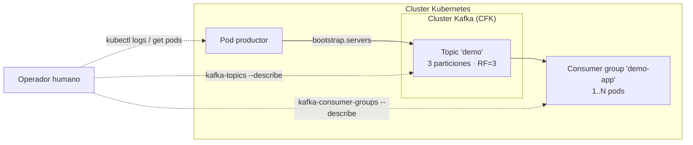

# Pipeline extremo a extremo: Producer → Topic → Consumer

[← Anterior: Kafka en Kubernetes](01-kafka-en-k8s.md) · [Índice del bloque ↑](README.md) · [Volver al inicio ↺](../../README.md)

---

## En síntesis

Al final del recorrido teórico, debería ser posible levantar **un productor sencillo** (puede ser una herramienta CLI o un pod con un script) que escriba a un topic, y **un consumidor** que lo lea, **dentro del cluster Kubernetes**, y **observar** la cadena completa: cómo se publica el mensaje, en qué partición cae, qué offset toma, qué grupo lo lee, qué lag se ve, qué pasa si se reinicia el consumidor. Todo lo visto en los bloques anteriores se reúne aquí en un único escenario observable.

## Qué se entiende por pipeline mínimo realista

Tres elementos:

- **Un productor** — proceso (pod) que emite mensajes con cierta cadencia, con clave significativa.
- **Un topic** — con varias particiones y replicación, en el cluster Confluent gestionado por CFK.
- **Un consumidor** — proceso (pod) que pertenece a un consumer group y procesa los mensajes.

No hace falta lógica de negocio compleja: lo importante es **poder explicar qué pasa en cada salto**.

## Lo que debería poder narrarse al final

A modo de checklist mental:

1. **El productor** se conecta al `bootstrap.servers`, descubre metadatos, identifica los líderes de partición.
2. Si envía con clave, el mensaje cae siempre en la misma partición. Sin clave, se reparte.
3. **El líder** persiste el mensaje en su log y propaga al ISR.
4. Con `acks=all`, **espera** confirmación de las réplicas en ISR antes de devolver el OK.
5. **El consumidor** del grupo descubre qué particiones le toca leer.
6. Lee, procesa, **commit-ea** offsets.
7. Si se cae, otro consumidor del grupo (o él mismo al levantarse) **retoma desde el último offset committed**.
8. Si **se mata un broker** durante el pipeline, los líderes afectados se mueven y los clientes lo notan en milisegundos. Si todo está bien configurado, **no se pierden mensajes**.

Cada uno de estos puntos se ha tratado por separado en los capítulos anteriores. El pipeline completo los **conecta**.

## Decisiones de diseño razonables

Pequeñas elecciones que marcan la diferencia entre un pipeline correcto y uno que se cae a la primera:

| Decisión | Recomendación | Por qué |
|----------|--------------|---------|
| Réplicas del topic | 3 | ISR sano con tolerancia a 1 caída. |
| `min.insync.replicas` | 2 | Si caen 2 brokers, escrituras se paran (preferible a perder). |
| Particiones | 3+ | Permite paralelismo en el consumidor sin matar el grupo. |
| `acks` del productor | `all` | Durabilidad real. |
| Clave del mensaje | Con clave de entidad | Orden por entidad. |
| Auto-commit del consumidor | **Desactivado** | Commit manual tras procesar. |
| Estrategia de asignación | Cooperative Sticky | Rebalanceos más suaves. |

Este conjunto es un buen punto de partida para diseñar servicios reales.

## Cómo observar lo que pasa

Cuatro vistas conviene tener abiertas en paralelo durante una prueba:

- **Logs del productor** — qué está enviando, errores.
- **Logs del consumidor** — qué procesa, commits.
- **`kafka-consumer-groups --describe`** — offsets y lag por partición.
- **`kafka-topics --describe`** — líderes, ISR, réplicas.

Y, si se trabaja en Kubernetes:

- **`kubectl get pods -w`** — para ver caídas y arranques en directo.

## Variantes interesantes para experimentar

Ideas que enriquecen el ejercicio:

- **Acelerar el productor** para ver crecer el lag y entender cuándo el grupo se queda atrás.
- **Escalar el consumidor** (replicar el pod a 2 o 3) y observar el reparto de particiones y el rebalanceo.
- **Matar un broker** mientras el pipeline corre, ver que sigue funcionando y luego observar la reincorporación al ISR.
- **Matar el consumidor** en mitad de procesamiento y comprobar que al volver retoma desde el offset committed sin perder mensajes (at-least-once).

## Diagrama: el pipeline completo

## Preguntas frecuentes

- **¿Hace falta escribir código real?** Para una primera prueba pueden usarse las herramientas CLI de Confluent (`kafka-console-producer`, `kafka-console-consumer`) o pequeños scripts/aplicaciones de referencia. El objetivo no es el código sino la **observación**.
- **¿Y si el productor escribe más rápido de lo que se procesa?** El topic absorbe; el consumer group acumula lag. Es la situación más común en producción y la que motiva escalado y monitorización.
- **¿Esto sirve para diagnosticar problemas reales?** Esa es la idea. Los principios son los mismos en un cluster pequeño de 3 brokers que en uno de 30 brokers en producción.

## Cierre

Con este capítulo se cierra el recorrido teórico:

- **Bloque 1** — Kubernetes como plataforma.
- **Bloque 2** — Kafka y Confluent como aplicación distribuida.
- **Bloque 3** — Una cosa **dentro** de la otra, observable y diagnosticable.

El siguiente paso natural es **profundizar en operación avanzada**: monitorización (Prometheus, Grafana), seguridad (mTLS, RBAC), backup/restore, multicluster, MirrorMaker 2, y patrones de aplicación (Kafka Streams, transactional producers).

---

### Laboratorio !!

[**Lab 14 — Pipeline completo Producer → Topic → Consumer →**](../lab-14-pipeline-completo/README.md)

*Cierre práctico del curso: extremo a extremo sobre el montaje integrado.*

---

[← Anterior: Kafka en Kubernetes](01-kafka-en-k8s.md) · [Índice del bloque ↑](README.md) · [Volver al inicio ↺](../../README.md)
